# Заявки

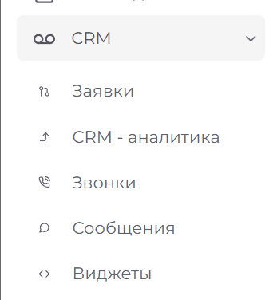

CRM заявки это - обращения или запросы от клиентов, которые фиксируются в системе. Заявки могут касаться записи на прием, запросов на консультации. CRM система позволяет отслеживать эти заявки, управлять ими и обеспечивать своевременное реагирование.

Для доступа к модулю "CRM заявки" необходимо выбрать пункт "CRM", после чего вы сможете увидеть данный модуль.

В правом верхнем углу интерфейса расположены кнопки для работы с разделом:

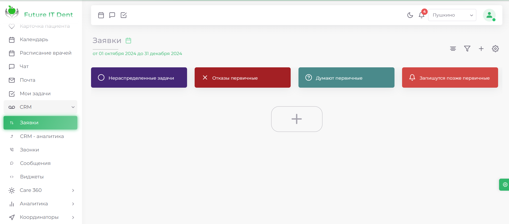

|Элемент| Описание|
|-------|---------|
|Здесь должен быть скрин|Параметры сортировки|
|Здесь должен быть скрин|Фильтры|
|Здесь должен быть скрин|Новая заявка|
|Здесь должен быть скрин|Настройка воронок|

## Сортировка

Позволяет сортировать заявки по: дате обновления, дате создания и имени ответственного лица. Для применения выбранных фильтров нажмите соответствующую кнопку.

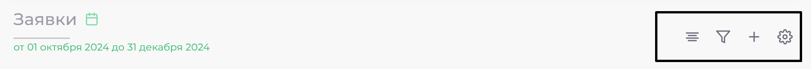

## Фильтры

В разделе фильтрации заявок доступен широкий список критериев:

1) Статус заявки:

* **Все заявки** — отображает полный перечень заявок без исключений.
* **Активные** — включает только те заявки, которые находятся в процессе выполнения
* **В архиве** — содержит заявки, которые были закрыты или завершены.

2) Данные заявки: 

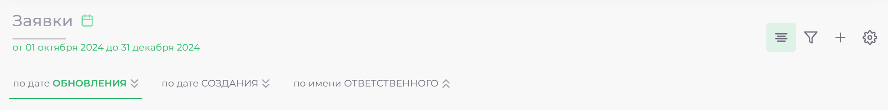
 
* **Все** — отображает все заявки с записями на прием, независимо от их статуса.
* **С запланированным приемом** — показывает только те заявки, для которых назначен конкретный прием.
* **Без приема** — включает заявки, которые не имеют назначенного приема.
Выбор соответствующего статуса позволит эффективно находить и управлять заявками в зависимости от их текущего состояния. 

3) Данные заявки. Позволяет найти заявки по значениям в определённых полях.

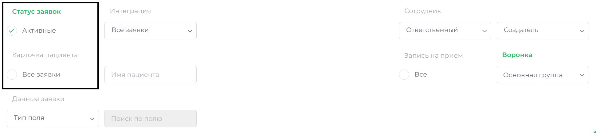

4) Интеграция. Покажет все заявки определённой интеграции.

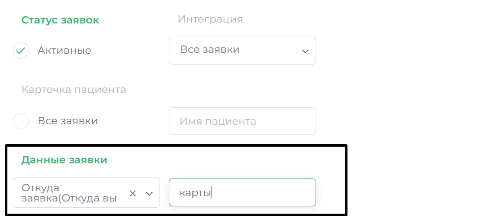

5) Сотрудник. Позволяет отфильтровать карточки по ответственному лицу или создателю заявки.
 
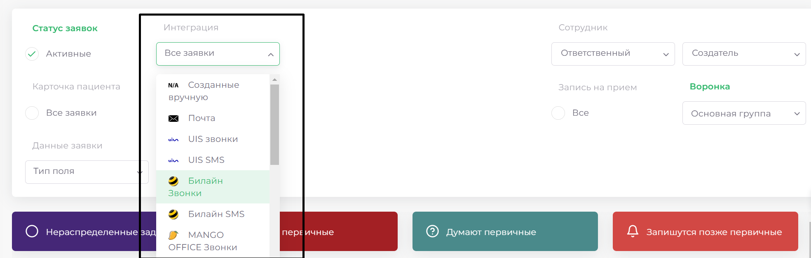

6) Запись на приём:
* Все
* С запланированным приёмом – заявки пациентов с уже запланированным приёмом.
* Без приёма – заявки пациентов без запланированного приёма.

7) Воронка. Позволяет переключаться между воронками.

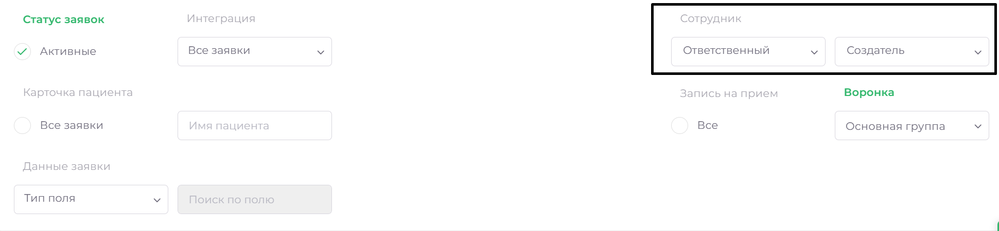

## Новая заявка

При нажатии на кнопку, откроется окно создания заявки. Поля разделены на три группы: 

1) Основная информация по заявке:

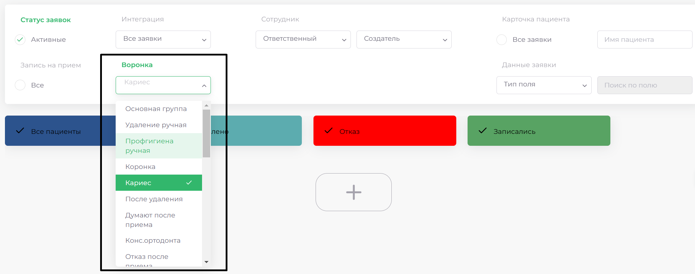

2) Обязательная:

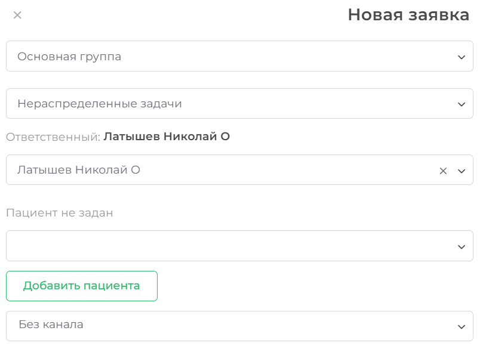

 
3) Необязательная:

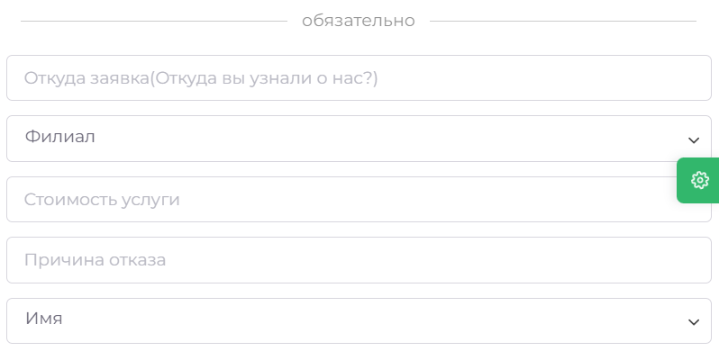

## Настройки воронок

1) **Колонки**
При нажатии, откроется список ваших воронок. По нажатию на любую из них, откроется список колонок этой воронки с возможностью редактирования. Здесь можно изменить название колонки, цвет, символ для уже существующих. Также здесь можно удалить колонку или создать новую. 

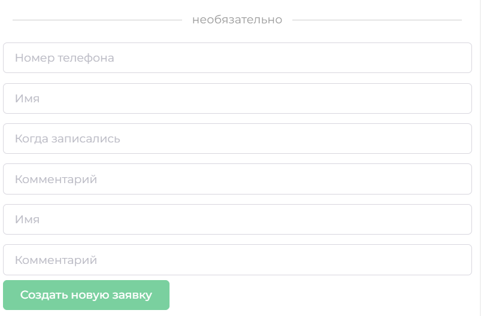

2)  **Данные из заявки**
Здесь можно настроить обязательные и необязательные поля для заявок в CRM. Здесь можно определить название поля, выбрать тип (текст, список для выбора, номер телефона, почта и т.д.), включить или выключить видимость, удалить и добавить новое поле.

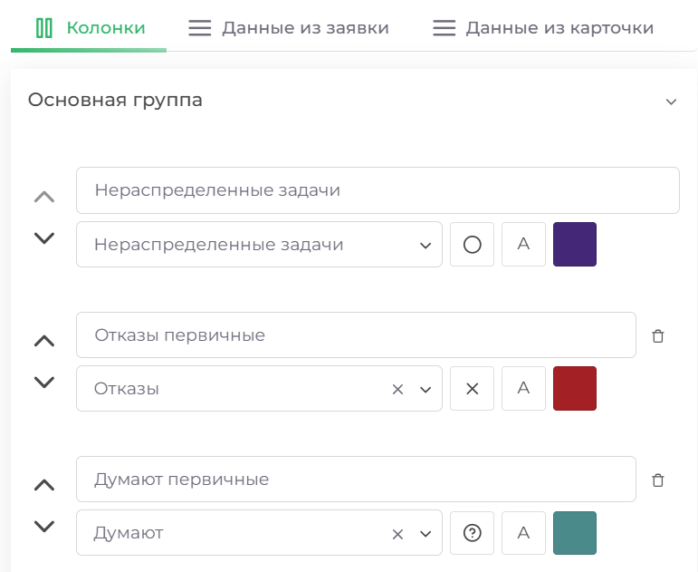

3) **Данные из карточки**
Здесь настраиваются поля с данными, которые будут загружаться из карточки пациента. 

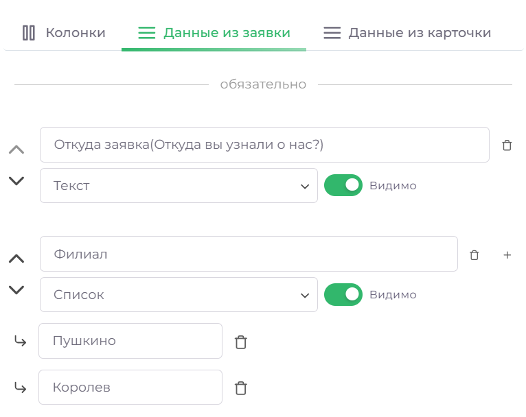
