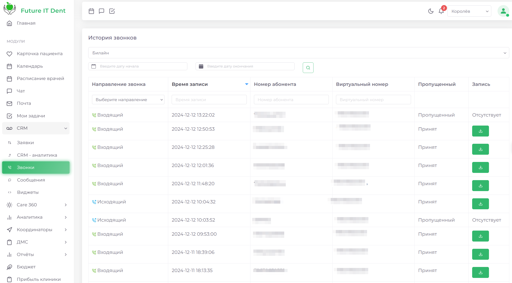
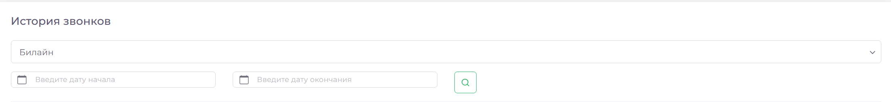
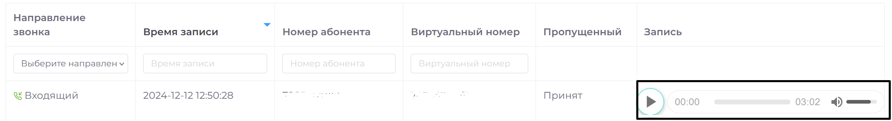

# Звонки

Модуль "CRM: Звонки" представляет собой мощный инструмент для управления и анализа всех звонков, связанных с деятельностью вашей клиники и её интеграцией с различными сервисами. 

Раздел содержит полную информацию о каждом звонке, предоставляя пользователю возможность ориентироваться в данных и эффективно с ними работать. Благодаря детализированным параметрам, можно не только отслеживать статус звонков, но и анализировать важные показатели, которые помогают улучшить качество обслуживания пациентов.

## Основные параметры звонка

Каждый звонок, зарегистрированный в системе, включает ряд параметров, которые помогут вам лучше понять детали взаимодействия с пациентами:
**Направление звонка**: система фиксирует, был ли звонок входящим или исходящим, что помогает отслеживать, кто инициировал контакт.
**Время записи**: точный момент времени, когда звонок был сделан, отображается в системе, что позволяет легко сопоставить его с другими событиями.
**Номер абонента**: отображается номер телефона пациента, что помогает мгновенно определить, кто звонил.
**Виртуальный номер**: если ваша клиника использует виртуальные номера для звонков, они также будут отображаться в системе, что упрощает управление звонками.
**Статус звонка**: система фиксирует, был ли звонок пропущен или принят, что позволяет своевременно реагировать на пропущенные вызовы.
**Запись разговора**: для каждого звонка система сохраняет запись разговора с пациентом, что позволяет при необходимости прослушать его повторно.

## Фильтрация звонков

Для удобства пользователей в модуле предусмотрена гибкая система фильтрации. Вы можете легко настроить фильтр по дате, выбрав период времени или необходимую интеграцию. 

Чтобы воспользоваться фильтром:

1. Выберите период времени, за который хотите отобразить звонки.
2. Выберите необходимую интеграцию (если используете несколько).
3. Нажмите на кнопку поиска.

Этот функционал позволяет быстро сузить круг отображаемых звонков, что особенно полезно при большом количестве данных.

## **Прослушивание записей звонков**

Система предоставляет возможность не только хранить записи звонков, но и прослушивать их в любое время. 
 
1. Найдите нужный звонок в списке.
2. Нажмите на кнопку "Прослушать запись", расположенную рядом с данным звонком.

Для вашего удобства интерфейс поддерживает перемотку записи и регулировку громкости. Это делает процесс прослушивания максимально комфортным и позволяет быстро найти нужные моменты в записи.

## Управление списком звонков

В нижней части страницы находится инструмент для управления отображением списка звонков. Вы можете настроить количество отображаемых элементов на странице — от 10 записей до показа всех звонков за выбранный период. Это полезно для контроля за объемом отображаемой информации.
Также доступна навигация по страницам списка, что упрощает просмотр длинных списков. Справа на экране размещены кнопки для перемещения между страницами списка. А если вам нужно быстро вернуться в начало, достаточно нажать на зелёную кнопку и система автоматически поднимет вас вверх страницы.
