# CRM-Аналитика

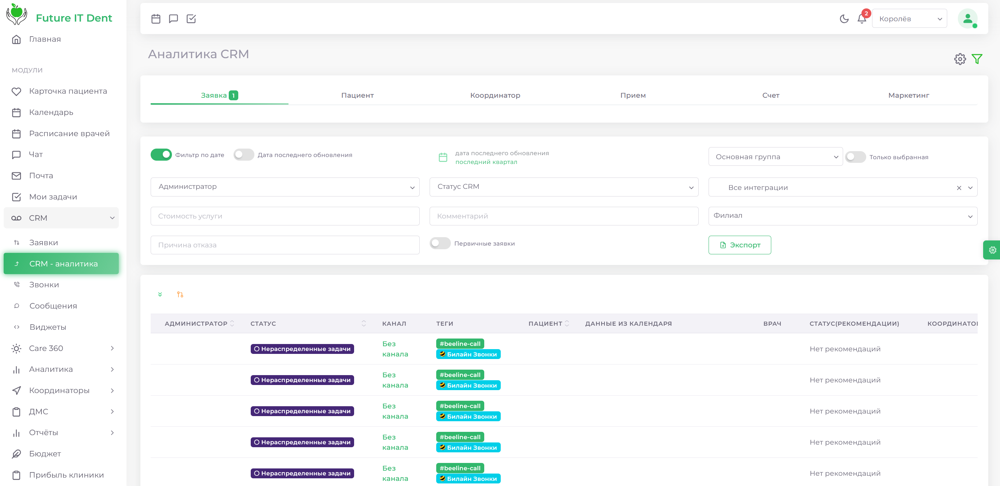

В данном разделе представлена аналитика по заявкам и пациентам, осуществляемая с использованием виджетов. CRM-аналитика в программном обеспечении Future IT Dent является инструментом для эффективного управления взаимоотношениями с клиентами. 

Она включает в себя средства для сбора, анализа и интерпретации данных о клиентах, что способствует повышению качества обслуживания и оптимизации процессов.

В правом верхнем углу интерфейса расположены кнопки: 

* Фильтр
* Шестеренка

## Шестеренка

При нажатии на кнопку шестеренки открывается меню с сохраненными фильтрами. Здесь вы можете выбрать уже созданный фильтр или сохранить новый. Для этого просто введите название фильтра и нажмите кнопку Сохранить. Это позволит вам быстро получать доступ к часто используемым настройкам и упростит работу с аналитикой.

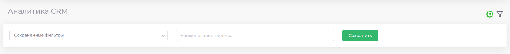

Чтобы выбрать сохранённый фильтр, необходимо нажать на раздел "Сохранённые фильтры" и выбрать соответствующий фильтр из предложенного списка.

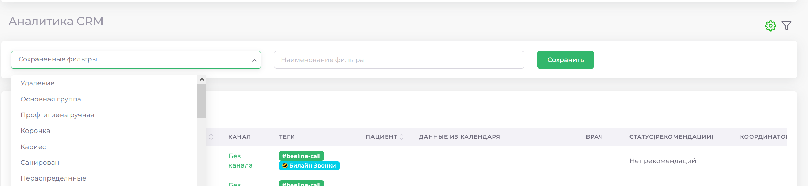

Для сохранения созданного вами фильтра необходимо ввести его название и нажать кнопку "Сохранить".

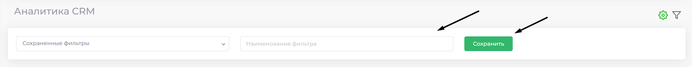

## Фильтр

Позволяет сортировать заявки по следующим категориям: заявка, пациент, координатор, прием, счет, маркетинг
 

1) Категория «Заявка»

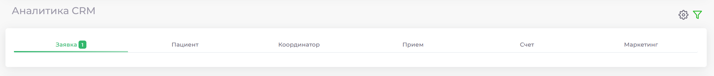
 

В разделе "Заявка" предусмотрен фильтр по дате. Для его активации переместите ползунок, после чего откроется меню, позволяющее сортировать заявки по дате последнего обновления и устанавливать интервал времени, задав начальную и конечную дату.

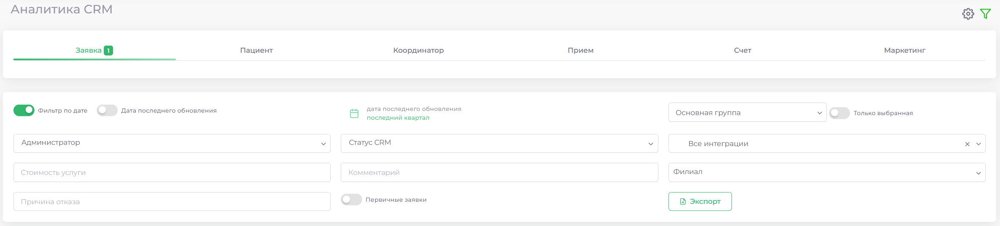

Следующий фильтр в категории "Заявка" представляет собой ползунок, который позволяет выбрать, из каких воронок отображать заявки. Перемещение ползунка вправо отобразит заявки из всех воронок, тогда как перемещение влево позволит выбрать только определённую воронку для отображения.

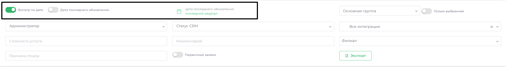

Кнопка "Администратор" в фильтре категории "Заявка" позволяет выбрать администратора, ответственного за определенные заявки.

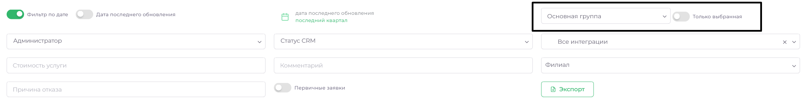

Кнопка "Статус CRM" в фильтре категории "Заявка" определяет, из какой колонки в данной группе будут отображаться заявки.

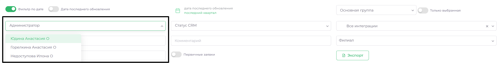

Кнопка "Интеграция" в фильтре категории "Заявка" позволяет осуществлять отбор и отображение заявок, относящихся к конкретным интеграциям, таким как Билайн или UIS.

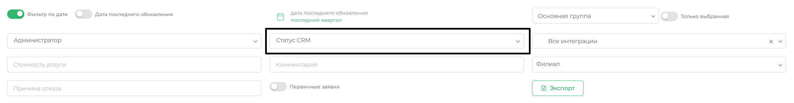

Фильтр-ползунок “Первичные заявки”  в категории "Заявки" предназначен для фильтрации первичных заявок. При активации данного ползунка будут отображены только те заявки, которые относятся к пациентам, обратившимся в клинику впервые.

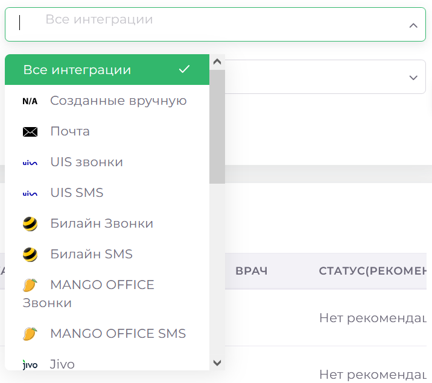

Кнопка экспорт предназначена для выгрузки списка пациентов в excel-формате.

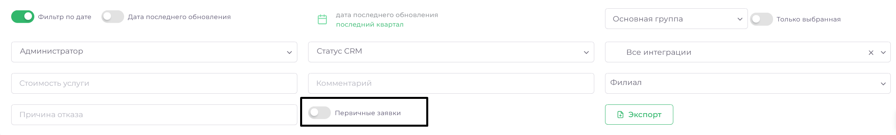

2) Категория «Пациент»

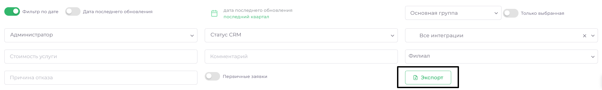

Переходя в категорию пациента, можно увидеть поисковую строку, в строке поиска, обозначенной как "Пациент...", вы можете ввести полное имя пациента (ФИО) для поиска конкретного пациента. Также возможно вводить только фамилию, что позволит отобразить всех пациентов с указанной фамилией.

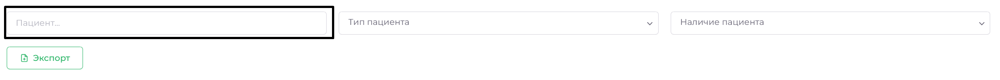

Кнопка "Тип пациента" в категории "Пациент" позволяет фильтровать пациентов по различным критериям. Вы можете выбрать один из следующих вариантов:

* Все пациенты — отображает полный список всех зарегистрированных пациентов.
* Первичные — показывает только первичных пациентов, которые обратились впервые.
* Вторичные — отображает пациентов, которые уже проходили лечение или обращались ранее.

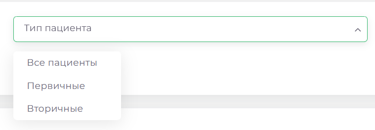

Кнопка Экспорт предназначена для выгрузки списка пациентов в excel-формате.

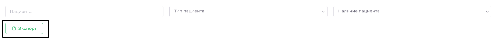

3) Категория «Координатор»

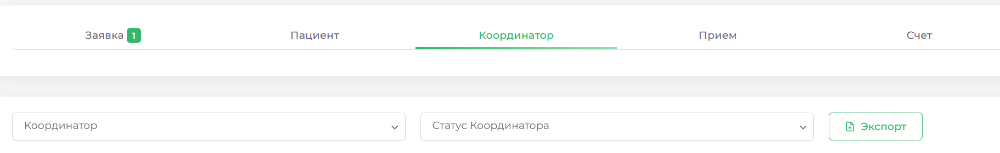

Поле Координатор позволяет фильтровать заявки по конкретному координатору.

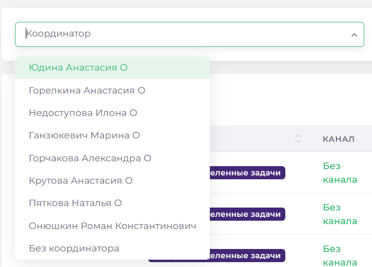

Поле Статус Координатора позволяет фильтровать заявки по статусам координаторов.

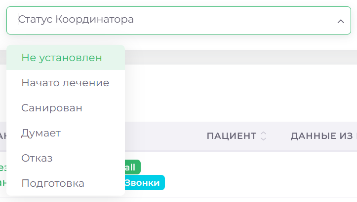

4) Категория «Прием»

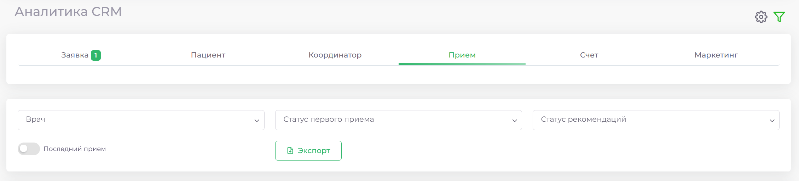

В категории "Прием" вы можете воспользоваться фильтром по врачу. Нажав на ячейку с фильтром, вы сможете выбрать конкретного врача, который занимается лечением данного пациента. Это позволяет быстро находить и отслеживать информацию о приемах и назначениях, связанных с выбранным врачом.

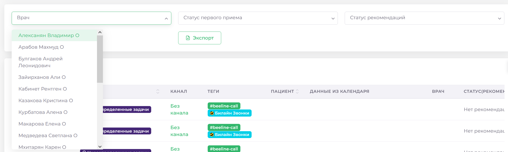

 Статус Первого приема фильтрует заявки по состояниям: "Первый прием не состоялся" и "Первый прием состоялся".

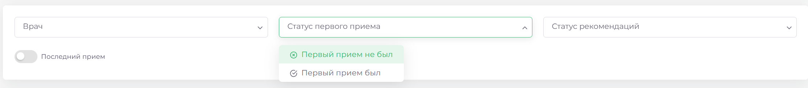

Статус рекомендаций включает два фильтра: "Нет рекомендаций" и "Есть рекомендации". Здесь вы можете выбрать приёмы, после которых (не)были назначены рекомендации к другим врача.

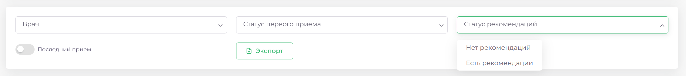

Ползунок "Последний прием" позволяет выбрать дату последнего приема в заданном интервале. Вы можете установить необходимый период для отображения данных.

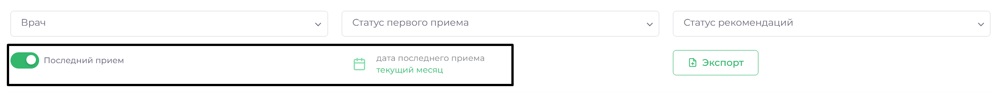

Кнопка экспорт предназначена для выгрузки списка пациентов в excel-формате

5) Категория «Счет»

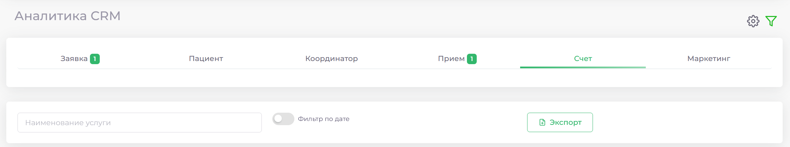

Здесь вы можете отфильтровать заявки по конкретной услуге и за определённый период.

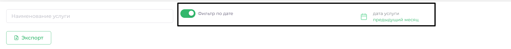

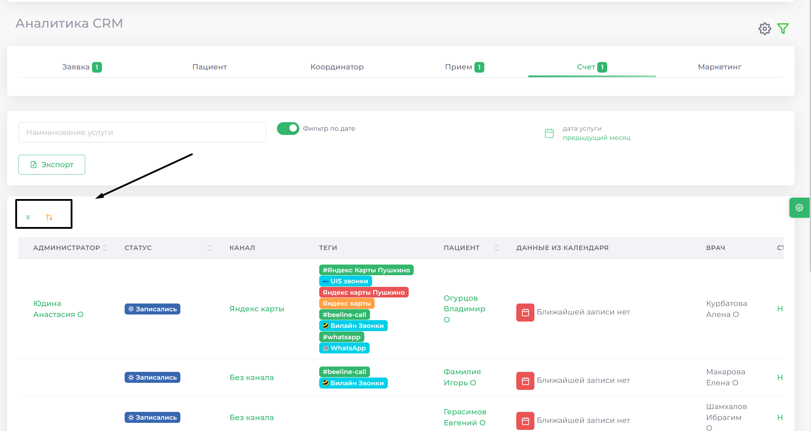

К каждом разделе, вам доступны кнопки расширения таблицы и переноса данных. Первая, откроет или скроет дополнительные поля заявок.
Вторая предназначена для передачи заявок между воронками.  

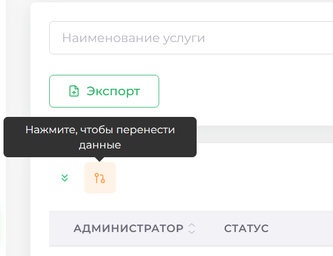

При нажатии откроется окно, в котором вы сможете выбрать целевую воронку и колонку для переноса ранее определённых вами заявок.

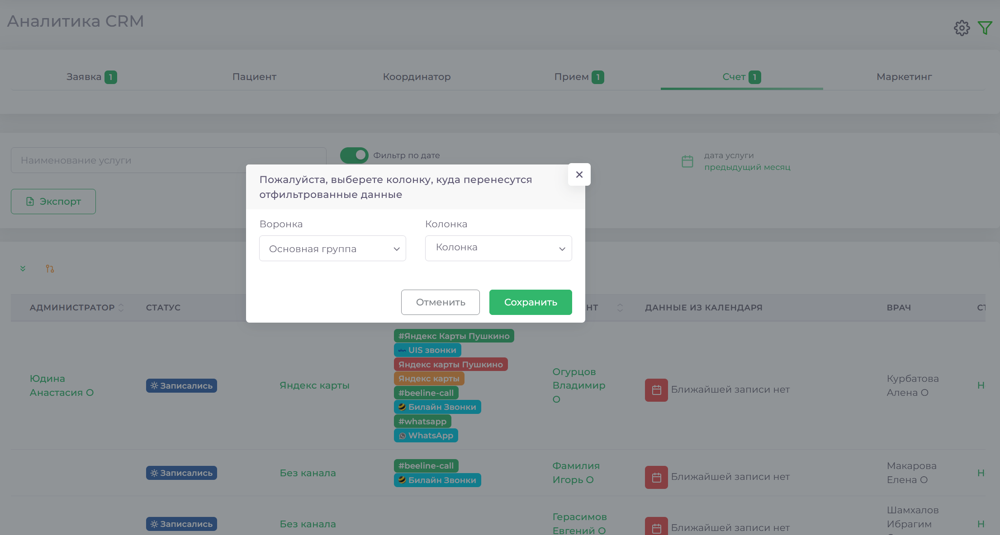
