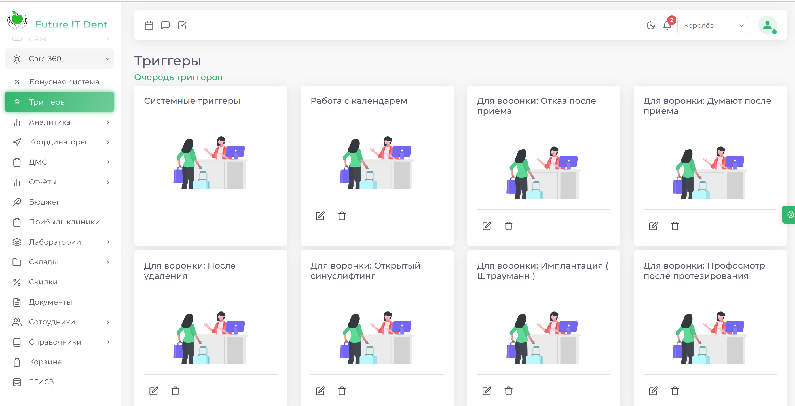

 
> Раздел Care360 предназначен для создания бонусных программ вашей клиники и настройки работы триггеров для автоматизации движения заявок в CRM-системе и отправки сообщений пациентам в соответствиие с установленным сценарием.
 
|Разделы                                               |Инструкции|
|------------------------------------------------------|----------|
|[Триггеры](/docs/Care360/triggers.md)                 | [Триггеры уведомлений](triggers#триггеры-уведомлений)  [Триггеры перемещений по воронкам](triggers#триггеры-перемещений-по-воронкам)|
|[Бонусная программа](/docs/Care360/bonus_programms.md)|

