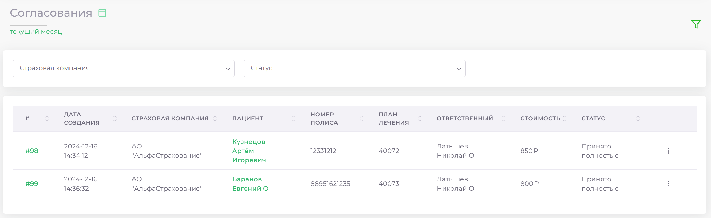
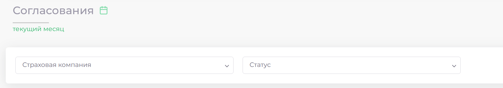
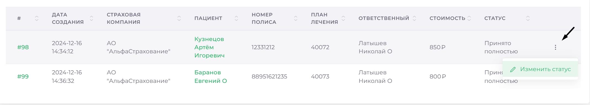

# Согласования 

> Модуль "Согласования" предназначен для управления статусами согласования выставленных счетов по ДМС. Он позволяет легко отслеживать статусы счетов и изменять их при необходимости. В модуле также предусмотрены удобные инструменты для фильтрации данных.

--- 

## Фильтрация данных

Для удобного поиска нужной информации используйте следующие фильтры:

1. Фильтр по дате:  
   Нажмите на значок календаря и выберите требуемый временной диапазон.

2. Фильтр по страховой компании:  
   Нажмите на поле Страховая компания и выберите нужную компанию из списка.

3. Фильтр по статусу:  
   Нажмите на поле Статус и выберите необходимый статус согласования.

---

## Изменение статуса плана лечения

1. Откройте раздел ДМС => Согласования.  
2. Выберите нужный план лечения из списка.  
3. Нажмите на кнопку троеточие справа от выбранного плана.  
4. В открывшемся меню выберите Изменить статус.  
5. Выберите новый статус из предложенных вариантов.  
6. Нажмите кнопку Сохранить для подтверждения изменений.

---