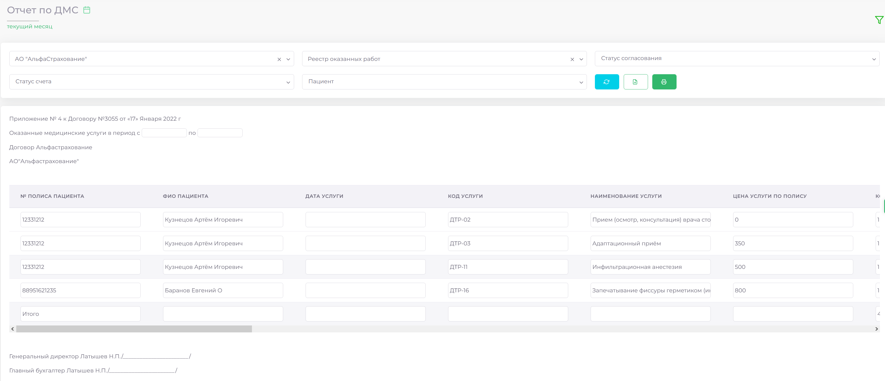
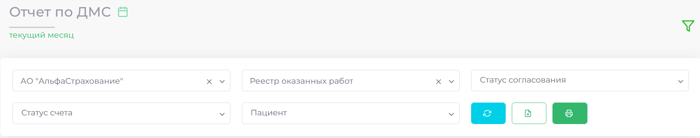
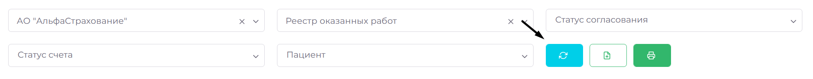
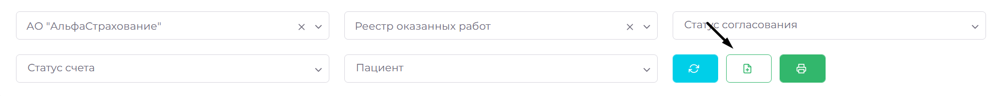
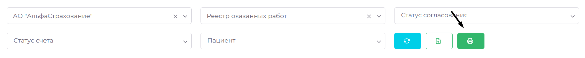

# Отчеты

> Модуль «Отчёты» предназначен для создания детализированных отчётов по работе с ДМС. Он предоставляет удобные инструменты для настройки параметров и экспорта отчётов, облегчая контроль и анализ данных.

## Создание отчёта

### Настройка фильтров

- Выберите временной период с помощью календаря.  
- Используйте дополнительные фильтры для выбора страховой компании, шаблона документа, статуса согласования и других параметров.

---

### Генерация отчёта

Нажмите кнопку «Генерировать», и система автоматически создаст отчёт на основе выбранных параметров.

---

### Экспорт отчёта

Вы можете экспортировать сформированный отчёт в удобном формате для дальнейшей обработки или хранения.

---

### Печать отчёта

Чтобы распечатать отчёт, нажмите кнопку «Печать».

---