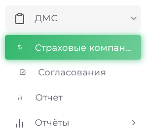

# ДМС

Модуль ДМС предоставляет инструменты для эффективного управления процессами, связанными с добровольным медицинским страхованием.
                                 

## Основные функции

- Управление страховыми компаниями: добавление, редактирование и удаление данных о компаниях и услугах.
- Работа с полисами: активация, деактивация, продление и изменение условий полисов.
- Отчётность: создание отчетов по работе с ДМС, с возможностью фильтрации и экспорта.
- Согласование счетов: отслеживание и изменение статусов счетов.
- Шаблоны отчетности: настройка шаблонов с автоматическим заполнением данных.
- Автоматизация: автоматическое создание отчетов и синхронизация данных с другими модулями.
- Фильтрация данных: поиск и фильтрация по различным параметрам (дата, страховая компания, статус и т.д.).

Эти функции упрощают управление процессами в рамках ДМС и повышают эффективность работы.