# Карточка пациента

> Модуль «Карточка пациента» предназначен для удобного доступа к информации для врачей,
> главврачей и администраторов. Все необходимые данные собраны в одном месте и 
> структурированы по разделам. Вы можете отдельно просматривать карты пациента 
> и истории болезни, ставить диагнозы и определять план лечения. 

## По нажатию на Аватар или Фамилию пациента Вы попадаете в его карточку

## При нажатии на вкладку можно перейти к соответствующей странице карточки пациента

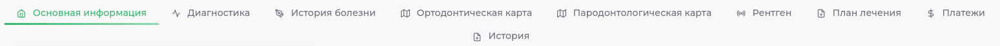

| Вкладка                                                               | Описание                                                                     |
|-----------------------------------------------------------------------|------------------------------------------------------------------------------|
| 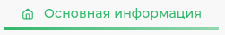 | Вкладка с основной информацией открывается по умолчанию                      |
| 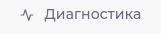         | На данной вкладке можно заполнить диагнозы пацинета                          |
|      | На данной вкладке можно заполнить Историю Болезни                            |
| 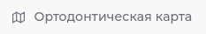         | На данной вкладке можно заполнить Ортодонтическую Карту                      |
| 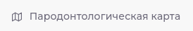      | На данной вкладке можно заполнить Пародонтологическую Карту                  |
| 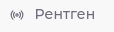                 | На данной вкладке можно загрузить 2D, 3D снимки, Фотопротокол, Видеопротокол |
| 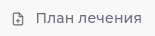             | На данной вкладке можно составить и просмотреть План Лечения                 |
| 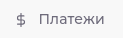                  | На данной вкладке можно выставить счет, провести оплату                      |
| 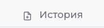               | На данной вкладке можно просмотреть детальную историю пациента               |

> Активная вкладка выделена нижним подчеркиванием

## Кнопки в карточке пациента позволяют:

| Кнопка                                                          | Описание                                                                                                                        |
|-----------------------------------------------------------------|---------------------------------------------------------------------------------------------------------------------------------|
| 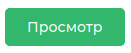    | Нажатие кнопки Просмотр позволяет перейти к редактированию информации о пациенте и печати справки НДФЛ                          |
| 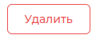      | Нажатие кнопки Удалить позволяет скрыть Карточку Пациента (информация о пациенте остается в приложении, но скрывается в поиске) |
| 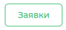  | Нажатие кнопки Заявки позволяет перейти в заявку пациента или объединить несколько заявок в одну                                |
| 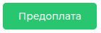  | Нажатие кнопки Предоплата позволяет внести на баланс пациента предоплату                                                        |
|     | Нажатие кнопки Бонусы позволяет начислить пациенту бонусы, если ему доступна бонусная программа                                 |
|  | Нажатие кнопки Снять позволяет списать средства с баланса пациента                                                              |
|   | Нажатие кнопки Распределить позволяет распределить средства с баланса пациента в оплату счета                                   |
