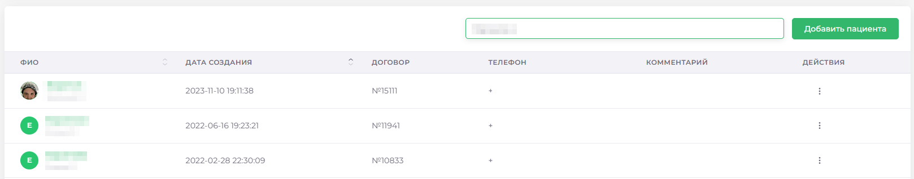
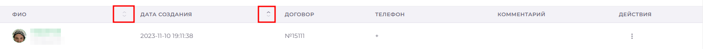
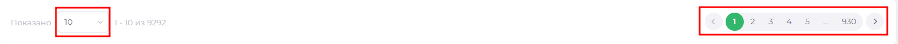
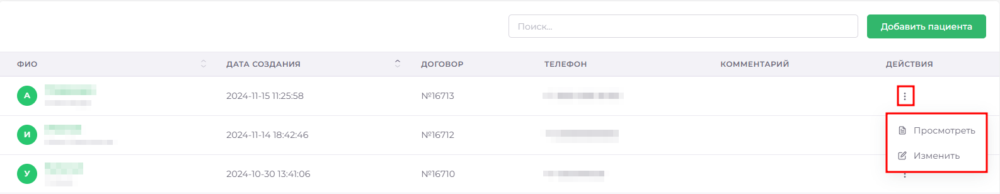

# Карточка пациента

> Модуль «Карточка пациента» предназначен для удобного доступа к информации для врачей,
> главврачей и администраторов. Все необходимые данные собраны в одном месте и 
> структурированы по разделам. Вы можете отдельно просматривать карты пациента 
> и истории болезни, ставить диагнозы и определять план лечения. 

## Общая работа с разделом

>В верхней части расположена строка поиска и кнопка добавления нового пациента. Поиск работает по **имени**, **фамилии**, **отчеству** или **номеру телефона**.
>Ниже расположен список пациентов и основная информация о них: **ФИО**, **дата занесения пациента в базу**, **номер договора**, **номер телефона** и **комментарий**.

>Вы можете отсортировать пациентов по **ФИО** (сортироваться будет по фамилии) или **Дате Создания**, нажатием на соответствующий пункт в таблице.

>В нижней части вы можете выбрать [количество выведенных пациентов на одной странице](docs/ui/ui.md#pagination), изменить количество элементов. В правой части Вы можете перейти от одной страницы к другой.

>В правой части строки пациента есть кнопка параметров ([три вертикальные точки]), при нажатии появится меню с пунктами Просмотреть и Изменить. Первая кнопка переведёт вас в раздел [Основная информация](./cardPatientView.md), вторая откроет раздел с полной информацией о пациенте с возможностью редактирования (Подробнее).

## По нажатию на Аватар или Фамилию пациента Вы попадаете в его карточку

