# Основная Информация

## При нажатии на [вкладку] можно перейти к соответствующей странице карточки пациента

| [Вкладка]                                                             | Описание                                                                                |
|-----------------------------------------------------------------------|-----------------------------------------------------------------------------------------|
|  | Вкладка с основной информацией открывается по умолчанию                                 |
|          | [На данной вкладке можно заполнить диагнозы пацинета](diagnoses.md)                     |
|      | [На данной вкладке можно заполнить Историю Болезни](history_disease.md)                 |
|          | [На данной вкладке можно заполнить Ортодонтическую Карту](orthodontic.md)               |
|       | [На данной вкладке можно заполнить Пародонтологическую Карту](parodonthic.md)           |
|                  | [На данной вкладке можно загрузить 2D, 3D снимки, Фотопротокол, Видеопротокол](x-ray.md) |
|              | [На данной вкладке можно составить и просмотреть План Лечения](t-plan.md)               |
|                   | [На данной вкладке можно выставить счет, провести оплату](invoice.md)                   |
|                | [На данной вкладке можно просмотреть детальную историю пациента]                       |

> Активная [вкладка] выделена нижним подчеркиванием

## [Кнопки](docs/ui/ui.md#button) в карточке пациента позволяют:

| [Кнопка](docs/ui/ui.md#button)                                                        | Описание                                                                                                                        |
|-----------------------------------------------------------------|---------------------------------------------------------------------------------------------------------------------------------|
|     | Нажатие кнопки Просмотр позволяет перейти к редактированию информации о пациенте и печати справки НДФЛ                          |
|       | Нажатие кнопки Удалить позволяет скрыть Карточку Пациента (информация о пациенте остается в приложении, но скрывается в поиске) |
|   | Нажатие кнопки Заявки позволяет перейти в заявку пациента или объединить несколько заявок в одну                                |
|   | Нажатие кнопки Предоплата позволяет внести на баланс пациента предоплату                                                        |
|     | Нажатие кнопки Бонусы позволяет начислить пациенту бонусы, если ему доступна бонусная программа                                 |
|  | Нажатие кнопки Снять позволяет списать средства с баланса пациента                                                              |
|   | Нажатие кнопки Распределить позволяет распределить средства с баланса пациента в оплату счета                                   |

## Семейный блок

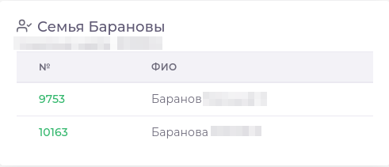

> Под основной информацией о пациенте расположен Семейный блок.  
> Если пациент не [добавлен ни в одну семью] - данный блок не отображаеся  
> В блоке отображается список членов семьи, их ФИО, а так же номер договора.

## Блок [документов](docs/documents/documents.md)

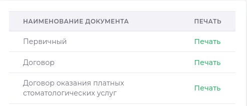

> Под основной информацией о пациенте расположен блок доступных к печати [документов](docs/documents/documents.md).
> При печати документа приложение подставит данные из Карточки пациента, в соответствии с указателями в шаблоне [документа](docs/documents/documents.md).

## События пациента

### Последние события пациента (Открываются по умолчанию)

> В правой части страницы отражены карточки с последними событиями пациента.  
> События, которых у пациента еще не было не отражаются в общем списке
> Для более детального отображения событий можно раскрыть [фильтр] и выбрать желаемый тип события

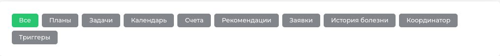

#### Чат

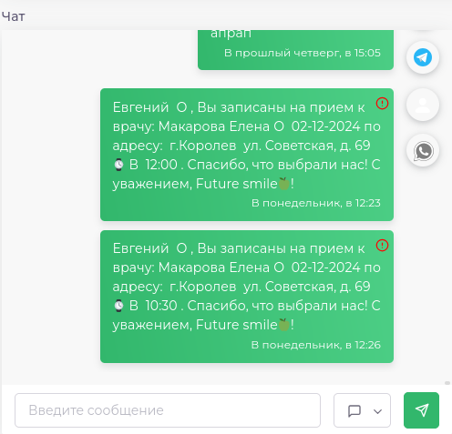

> Здесь отражается история переписки Клиники с пациентом. 

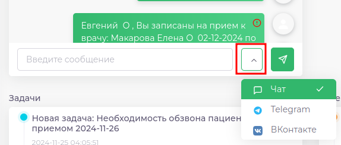

> Чтобы отправить сообщение пациенту, нужно написать текст сообщения, выбрать канал для отправки и нажать кнопку "отправить"  
> Так же написать пациенту можно несколькими [другими способами], в том числе приложение может отправлять сообщения автоматически, с помощью модуля [Care360]

### Планы

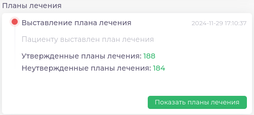

> Событие отражает дату и время последнего выставленного плана лечения  
> Количество утвержденных и неутвержденных планов лечения.  
> Цифра количества - [ссылка], нажав на которую можно перейти в Отчеты.План лечения  
> Нажатие кнопки "Показать планы лечения" переключит Вас на вкладку План лечения Карточки Пациента

### Задачи

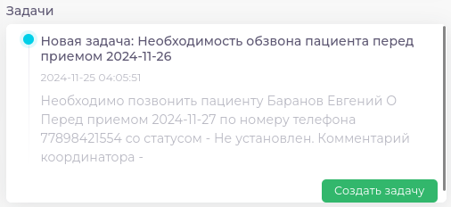

> Отображает последнюю [задачу] по пациенту.  
> По нажатию [Создать задачу] можно добавить новую задачу

### Календарь

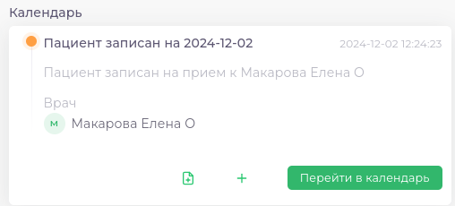  

> Отражает последнее событие в календаре (например: запись на прием, дату последнего приема)  

| Кнопка                                                           | Действие                          |
|------------------------------------------------------------------|-----------------------------------|
| 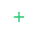   | Записать пациента на прием        |
| 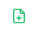 | Записать пациента в Лист Ожидания |

> Есть еще [несколько способов] записать пациента из других модулей

### [Счета](invoice.md)

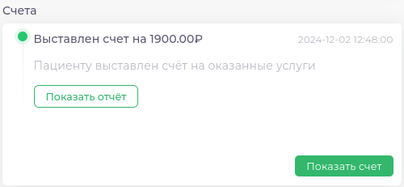  

> Отражает последний выставленный счет.  
> Нажатие на кнопку "Показать отчет" отобразит список услуг счета  
> Нажатие на кнопку "Показать счет" откроет [просмотр счета]

### Рекомендации

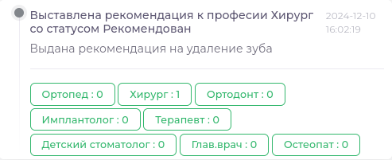  

> Отражается последняя [рекомендация], время когда рекомендация была выдана и [статус рекомендации]  
> При нажатии на кнопку можно перейти в Отчет.Рекомендации к врачам  

### Заявки

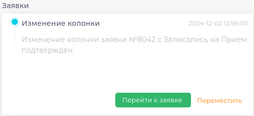

> Отражает последнее действие с [Заявкой] в [CRM-Системе]  
> Нажатие на кнопку "Перейти к заявке" откроет [заявку] пациента  
> Нажатие на кнопку переместить позволит [перенести заявку пациента]

### История болезни

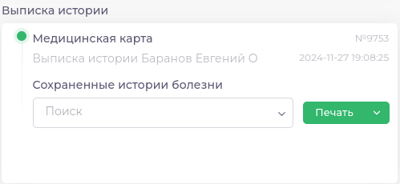

> Отражает последнюю сохраненную историю болезни  
> Можно выбрать в выпадающем списке нужную историю болезни и сразу отправить выписку на печать  
> 

### Координатор

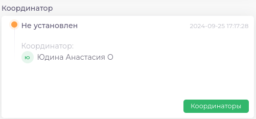  

> Отражает краткую информацию из модуля Координаторы  
> Нажатие на кнопку Координаторы позволяет увидеть подробную информацию о взаимодействии Координатора и пациента

### [Триггеры]

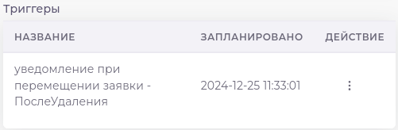  

> Данное событие отображается только в том случае, когда для пациента запланировано [автоматическое действие] (Отправка сообщения, перенос заявки и т.п.)