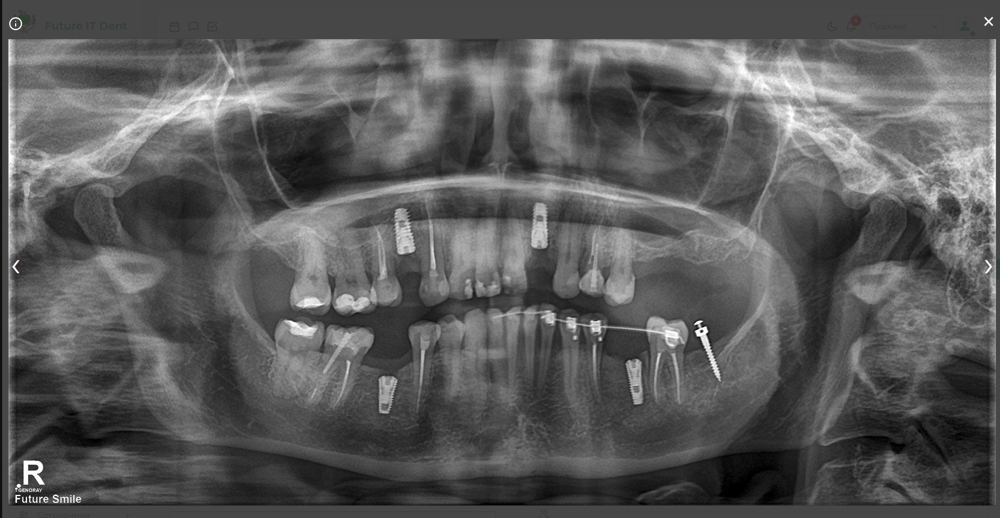
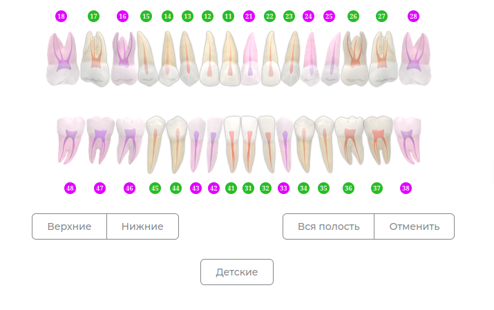
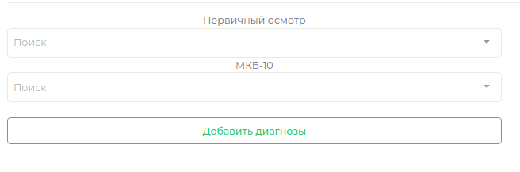
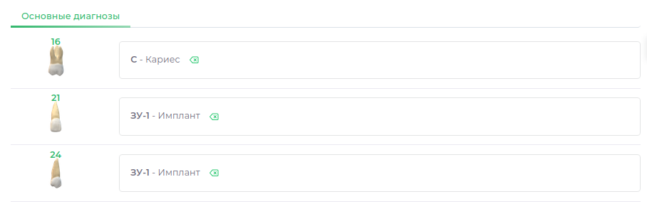

# Диагностика  

---

  

---

> Данный модуль предназначен для заполнения диагнозов пациента.  
> Модуль разделен на четыре блока:
 - Рентген-снимки  
 - Зубная формула  
 - Выбор диагноза  
 - Список проставленных диагнозов

---  

[Как заполнить диагностику](patient-instructions.md#fill_diagnostic)

---  

## Рентген-снимки

---  
Все снимки пациента отражаются в левой части экрана. 

> Добавить снимок можно в модуле [Рентген](docs/cardPatient/x-ray.md#add_x-ray)

Нажав на снимок - можно развернуть его на весь экран, для более детального изучения

## Зубная формула  

---  

  

В правой части экрана отражена интерактивная зубная формула.  
Все заполненные диагнозы так же будут отражены на вкладках [История болезни](history_disease.md) и [План лечения](t-plan.md)  
Так же возможно [распечатать] зубную формулу в [шаблоне] Плана лечения  

> [Подробнее о взаимодействии с зубной формулой]  

## Выбор диагноза

---

  

В левой нижней части экрана отражены доступные наборы диагнозов. Добавить новые диагнозы при необходимости Вы можете самостоятельно.

> [Как добавить новые диагнозы](patient-instructions.md#fill_diagnostic)  

## Список проставленных диагнозов

---  

В правой нижней части отображается список проставленных пациенту диагнозов