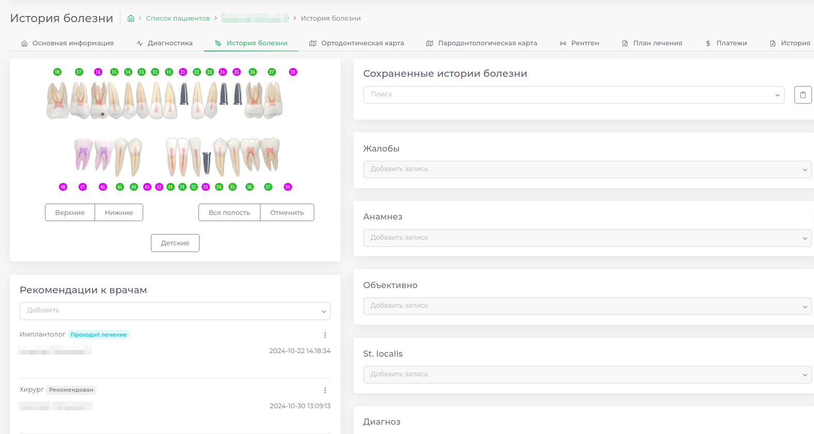
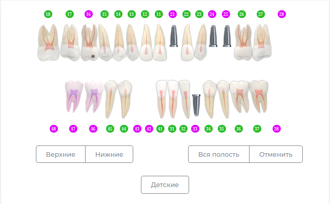
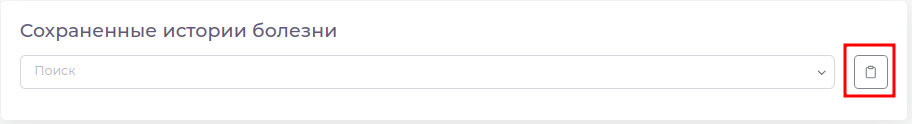
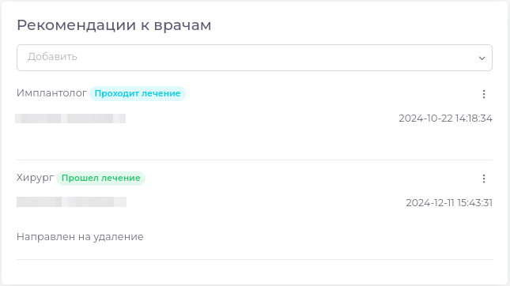

# История болезни  

---  

  

Данный модуль позволяет:

 - [Заполнить историю болезни](docs/cardPatient/patient-instructions.md#fill_history)  
 - [Просмотреть ранее заполненные истории болезни]
 - [Выдать рекомендацию к смежному специалисту]  
 - [Перейти в медицинскую карту]  
 - [Распечатать историю болезни]

 

## [Зубная формула](docs/ui/teeth.md) 

---

  

В верхней левой части экрана отображается интерактивная зубная формула с заполненными в [Диагностике](docs/cardPatient/diagnoses.md) диагнозами

## Пункты истории болезни  

---

  

В правой части экрана отображается список пунктов истории болезни.  
При заполнении истории болезни Вы можете воспользоваться ранее заготовленными [Шаблонами]

---

[Как изменить порядок пунктов в Истории болезни]

[Как добавить свои шаблоны к пунктам истории болезни]

---  

## Медицинская карта 043у

---

Нажав на выделенную кнопку Вы можете перейти в [Медицинскую Карту] пациенту 

## Рекомендации  

---

  

Под зубной формулой отображается список рекомендаций к смежным специалистам, выданных пациенту.
В данном списке отражен этап лечения, на котором находится пациент, комментарий к рекомендации и дата ее добавления.

Здесь Вы можете выдать новую рекомендацию, отредактировать уже существующую, составить план лечения, связанный с рекомендацией

---  

[Как добавить рекомендацию]

[Как изменить рекомендацию]

[Как составить план лечения по рекомендации]  

---  