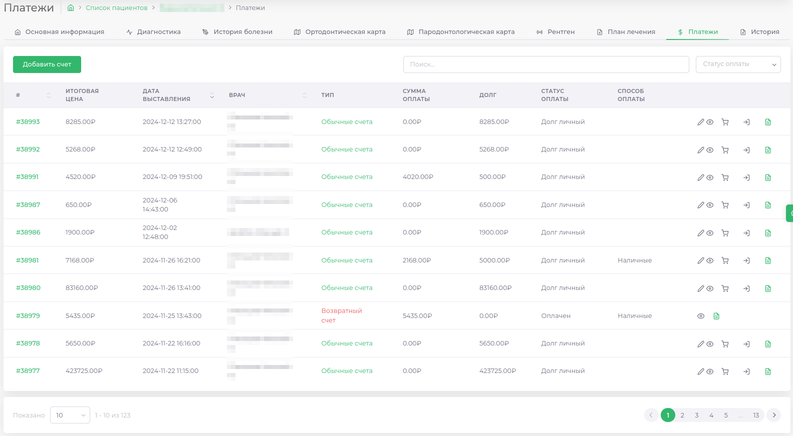
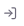

# Платежи

---

Данный модуль предназначен для работы со счетами пациента.  
В модуле отображается список всех выставленных пациенту счетов.

|Номер счета|Стоимость счета|Дата выставления|Лечащий врач|Тип|Сумма оплаты| Задолженность |Статус оплаты|Способ оплаты|
|---|---|---|---|---|---|---------------|---|---|

---

| Кнопка | Действие                         |
|--------|----------------------------------|
|| [Добавить новый счет]            |
|| [Перейти к редактированию счета] |
|| [Перейти к просмотру счета]      |
|| [Провести оплату по счету]       |
|| [Откатить счет]                  |
|| [Создать гарантийный счет]       |

> [Как добавить новый счет]
> [Как провести оплату по счету]
> [Как распечатать счет]
> [Как отредактировать счет]
> [Как распределить аванс пациента на счет]