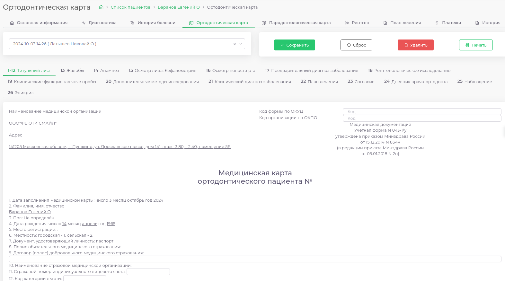
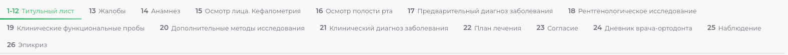
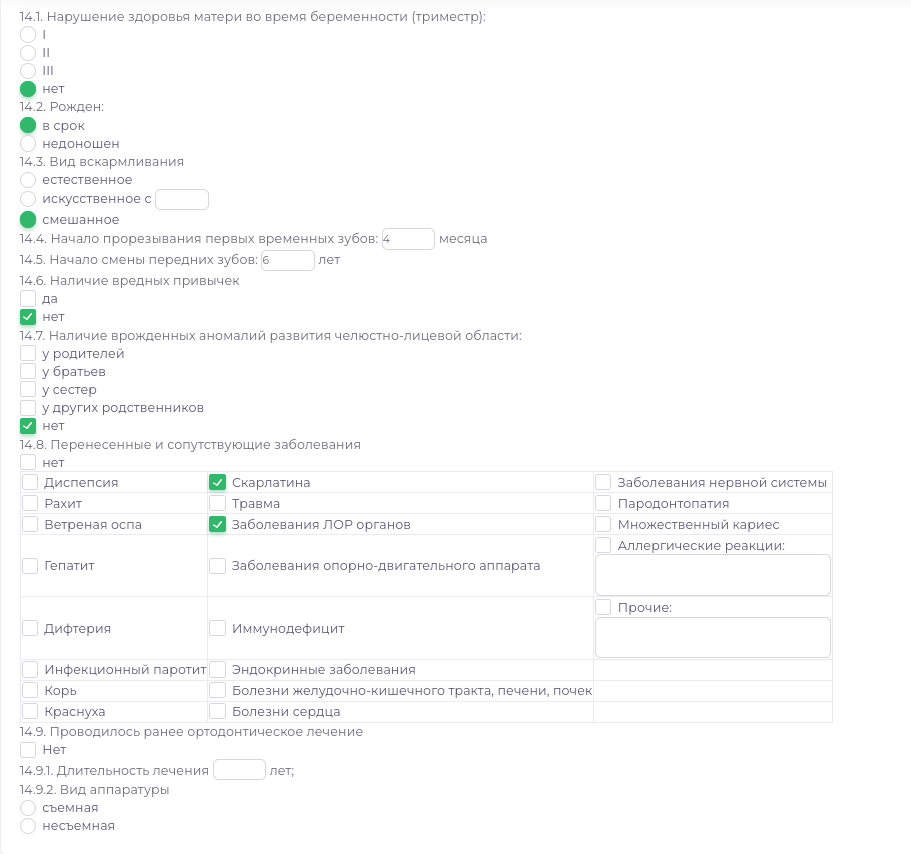

# Ортодонтическая карта

---

Модуль предназначен для заполнения ортодонтической карты пациента.  
Для удобства документ разделен на несколько пунктов

В документ автоматически подставляется информация о пациенте, организации 
Мы постарались сделать заполнение карты максимально удобным и интуитивно понятным для пользователя.

В процессе заполнения можно отметить нужные пункты нажатием левой кнопки мыши.

Пример:

После заполнения карты можно ее сохранить и отправить на печать