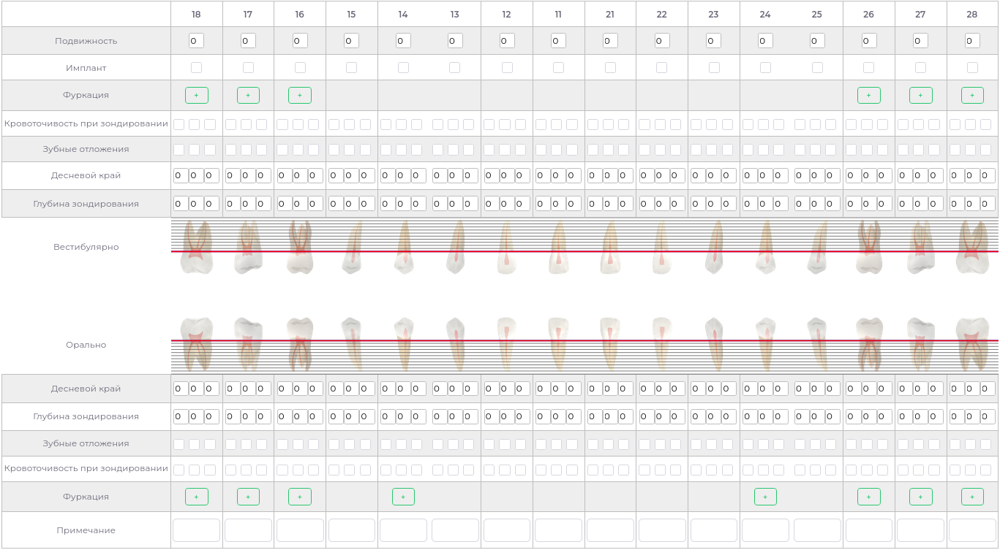
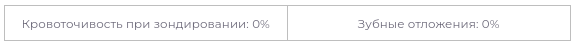

# Пародонтологическая Карта

---  

Модуль позволяет: 
 - заполнить пародонтологическую карту пациента  
 - Просмотреть ранее заполненные карты  
 - Сохранить заполненную карту
 - Распечатать заполненную карту

В модуле можно заполнить информацию о подвижности, кровоточивости, зубных отложениях и т.д.  
информация будет отражена визуально.

Между пародонтограммами расположены поля с информацией об общей кровоточивости и зубных отложениях.

