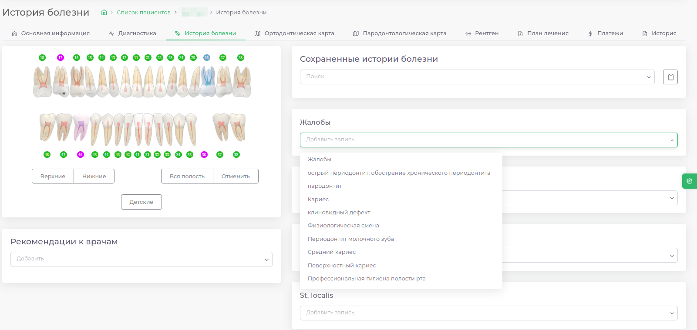
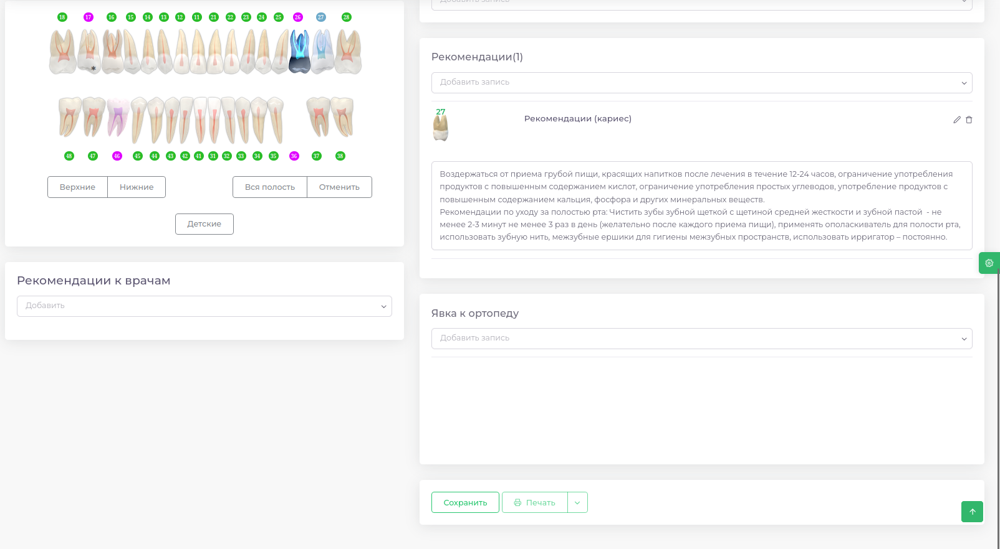
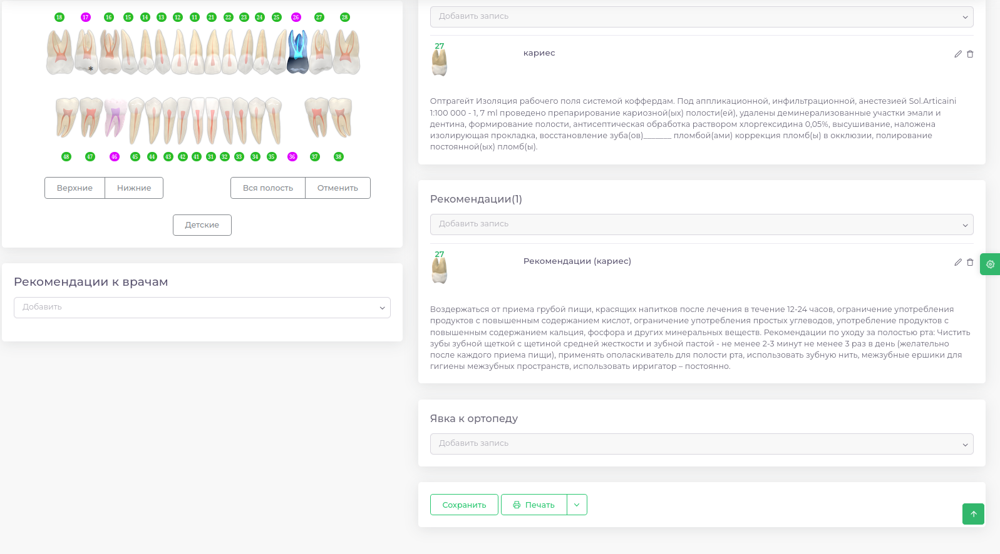
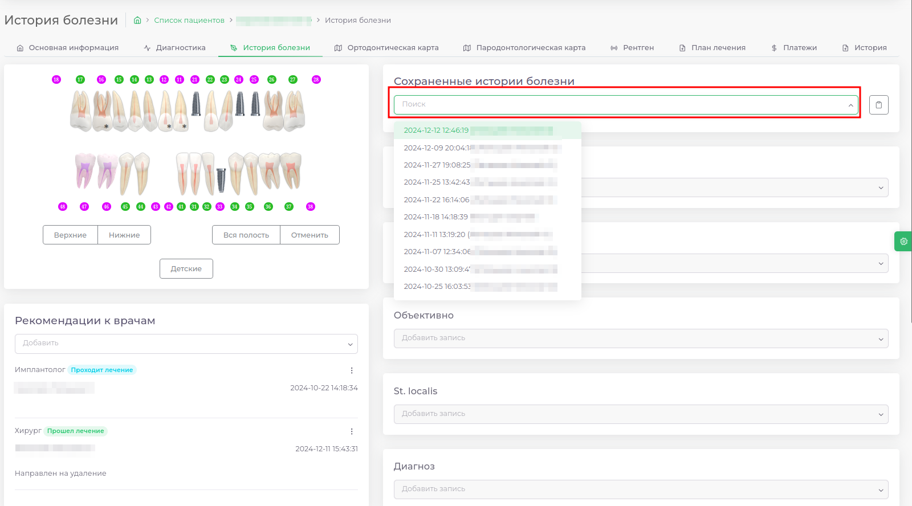
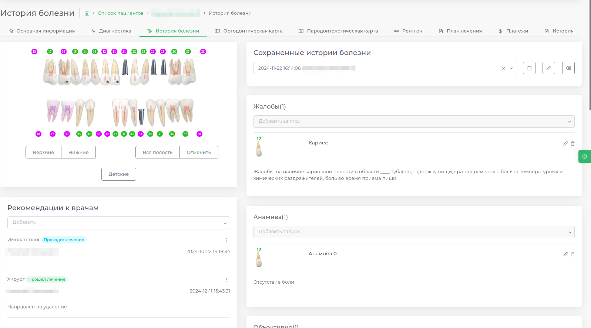
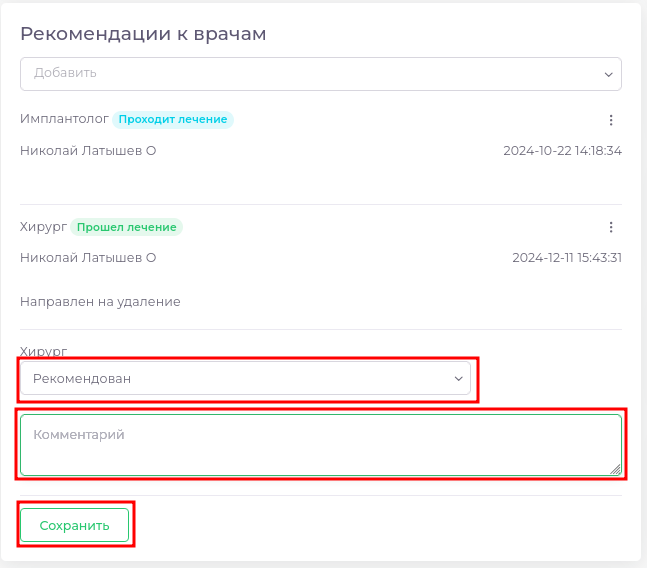
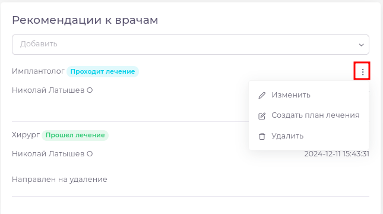
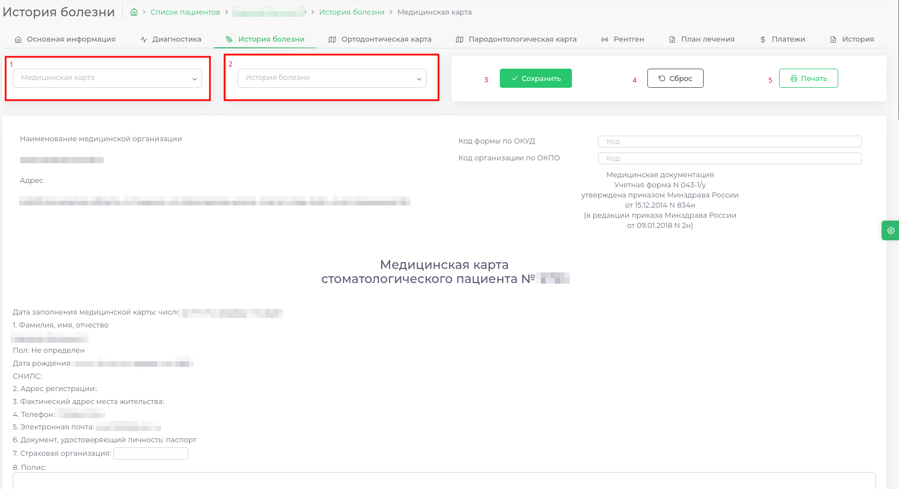

# Инструкции

---

## Общая работа с разделом

---

>В верхней части расположена строка поиска и кнопка добавления нового пациента. Поиск работает по **имени**, **фамилии**, **отчеству** или **номеру телефона**.
>Ниже расположен список пациентов и основная информация о них: **ФИО**, **дата занесения пациента в базу**, **номер договора**, **номер телефона** и **комментарий**.

>Вы можете отсортировать пациентов по **ФИО** (сортироваться будет по фамилии) или **Дате Создания**, нажатием на соответствующий пункт в таблице.

>В нижней части вы можете выбрать количество выведенных пациентов на одной странице, изменить количество элементов. В правой части Вы можете перейти от одной страницы к другой.

>В правой части строки пациента есть кнопка параметров (три вертикальные точки), при нажатии появится меню с пунктами Просмотреть и Изменить. Первая кнопка переведёт вас в раздел [Основная информация](./cardPatientView.md), вторая откроет раздел с полной информацией о пациенте с возможностью редактирования (Подробнее).

## Как добавить нового пациента

---

### Выбрать пункт Добавить пациента в верхнем правом углу раздела.

---

### Во всплывающем окне выбрать и заполнить раздел [Основная информация](./cardPatientView.md)

---

### Чтобы добавить пациента, необходимо заполнить обязательные поля

---

* Фамилия
* Имя
* День рождения
* Номер телефона

> Если пациент отказывается дать свой номер можно написать в данное поле несколько цифр, пока не появится зеленая галочка (Хотя мы рекомендуем указывать настоящий номер телефона пациента)

### Заполнить паспортные данные

---

#### Если пациент из СНГ

---

> В случае, когда пациент не является гражданином РФ необходимо включить переключатель "Другой документ"

### Заполните данные о проживании при необходимости

---

### После заполнения карточки нажмите кнопку добавить

---

## Как заполнить диагностику

---

| Чтобы заполнить диагнозы, необходимо                                   ||
|------------------------------------------------------------------------|---|
| Выделить зуб на зубной формуле нажатием левой кнопки мыши              ||
| Выбрать необходимые диагнозы (можно выбрать сразу несколько диагнозов) ||
| Нажать кнопку Добавить диагнозы                                        ||

## Как заполнить историю болезни

---

Для заполнения истории болезни необходимо: 
- Перейти в модуль [История болезни](history_disease.md)  
- Выбрать нужный зуб (зубы) (верхний ряд, нижний ряд, всю полость) на [Зубной формуле](docs/ui/teeth.md)
- Заполнить пункты истории болезни
  - Можно заполнить вручную
  - Можно подставить [заготовленный шаблон]
- Нажать [кнопку сохранить](docs/ui/ui.md#button)
- При необходимости можно распечатать выписку, нажав на кнопку **Печать**, расположенную внизу страницы

| Этап                                        | Пример                              |
|---------------------------------------------|-------------------------------------|
| Начало заполнения                           |  |
| Подставлен текст из шаблона                 |  |
| История болезни сохранена и готова к печати |  |

## Как посмотреть ранее заполненные истории болезни

---

Посмотреть заполненную историю болезни можно нажав на выпадающий список:

В списке указана дата и время сохранения истории болезни, ФИО сотрудника, сохранившего историю.

После выбора нужного пункта в списке вся ранее сохраненная информация будет подставлена в историю болезни.

## Как выдать рекомендацию к другому врачу

---  

Чтобы добавить новую рекомендацию:
- Перейти в модуль [История болезни](history_disease.md)
- Под зубной формулой расположен список рекомендаций
- В выпадающем списке нужно выбрать направление специалиста, к которому Вы хотите направить пациента
  - 
- Можно дополнить рекомендацию комментарием
- Выбрать статус рекомендации
  - 
- Нажать кнопку Сохранить

## Как изменить рекомендацию

---

  

Чтобы изменить рекомендацию: 
- Нажмите на три вертикальных точки
- Выберите пункт "Изменить"
- Откроется возможность изменить этап лечения по рекомендации, комментарий.
- Нажмите кнопку "Сохранить"

## Как составить план лечения по рекомендации

---

Чтобы составить план лечения по рекомендации:
- Нажмите на три вертикальных точки
- Выберите пункт "Составить план лечения"
- [Составьте план лечения]

## Медицинская карта

---

| Пункт | Описание                                                                                                                  |
|-------|---------------------------------------------------------------------------------------------------------------------------
| 1.    | Чтобы просмотреть ранее сохраненную медицинскую карту выберите ее из списка                                               |
| 2.    | Чтобы подставить информацию из сохраненной истории болезни выберите ее из списка                                          |
| 3.    | Чтобы сохранить заполненную медицинскую карту нажмите кнопку "Сохранить"                                                  |
| 4.    | Чтобы очистить медицинскую карту нажмите кнопку "Сброс"                                                                   |
| 5.    | Чтобы распечатать медицинскую карту - выберите из списка ранее сохраненную карту или заполните ее. Нажмите кнопку "Печать" |
