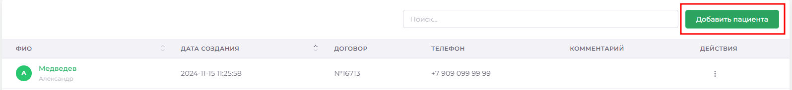
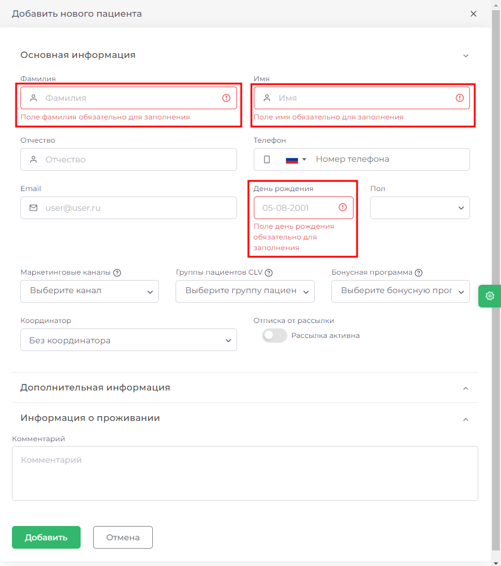
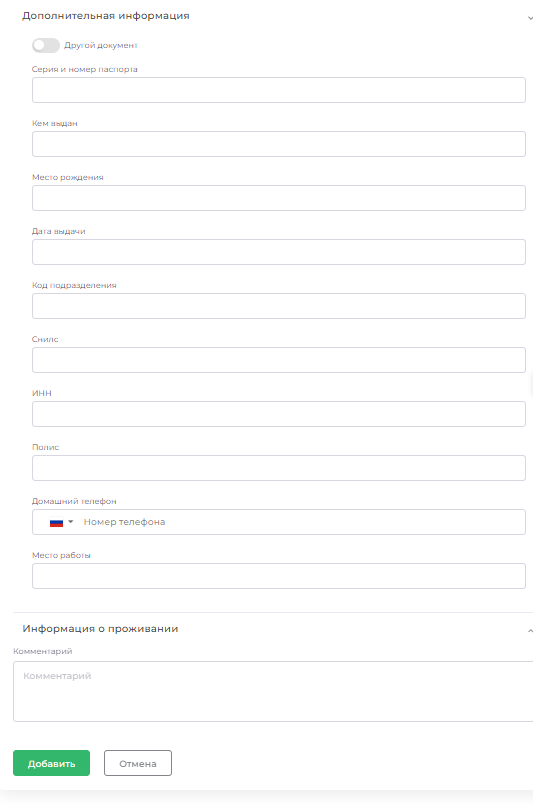
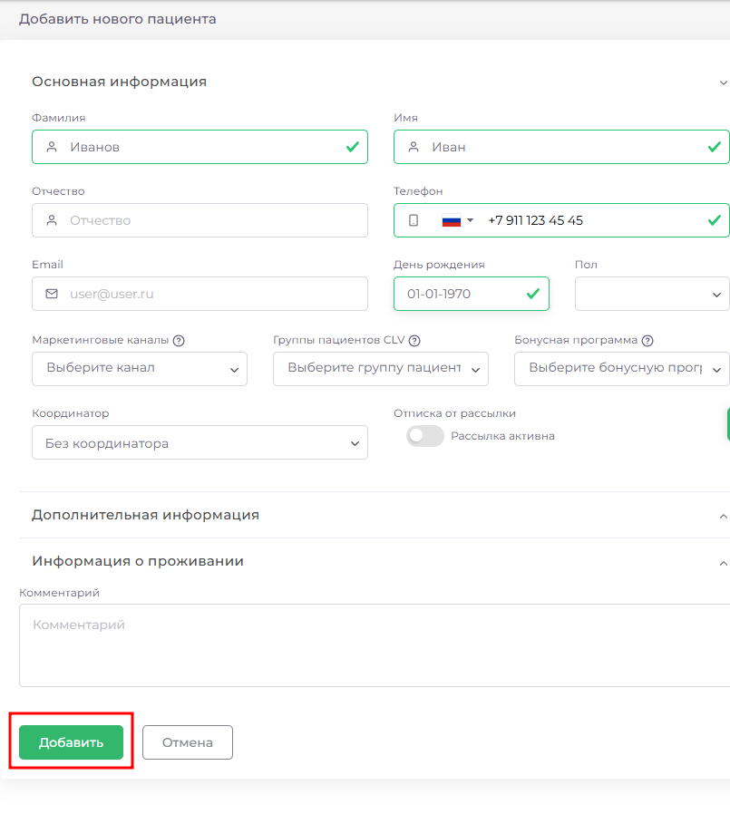
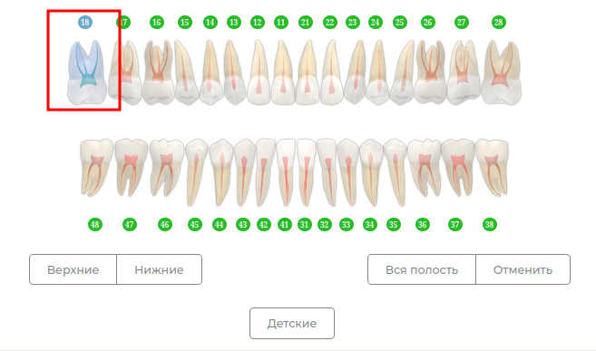
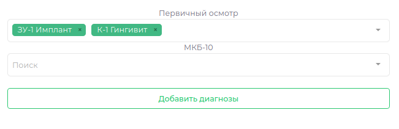
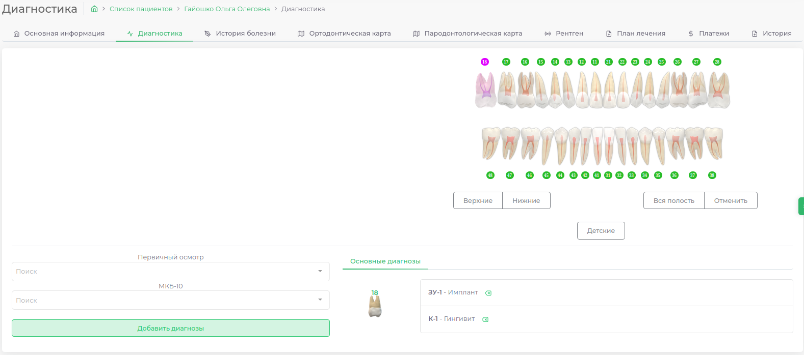

# Инструкции

## Общая работа с разделом

>В верхней части расположена строка поиска и кнопка добавления нового пациента. Поиск работает по **имени**, **фамилии**, **отчеству** или **номеру телефона**.
>Ниже расположен список пациентов и основная информация о них: **ФИО**, **дата занесения пациента в базу**, **номер договора**, **номер телефона** и **комментарий**.

>Вы можете отсортировать пациентов по **ФИО** (сортироваться будет по фамилии) или **Дате Создания**, нажатием на соответствующий пункт в таблице.

>В нижней части вы можете выбрать количество выведенных пациентов на одной странице, изменить количество элементов. В правой части Вы можете перейти от одной страницы к другой.

>В правой части строки пациента есть кнопка параметров (три вертикальные точки), при нажатии появится меню с пунктами Просмотреть и Изменить. Первая кнопка переведёт вас в раздел [Основная информация](./cardPatientView.md), вторая откроет раздел с полной информацией о пациенте с возможностью редактирования (Подробнее).

## Как добавить нового пациента

### Выбрать пункт Добавить пациента в верхнем правом углу раздела.

### Во всплывающем окне выбрать и заполнить раздел [Основная информация](./cardPatientView.md)

### Чтобы добавить пациента необходимо заполнить обязательные поля

* Фамилия
* Имя
* День рождения
* Номер телефона

> Если пациент отказывается дать свой номер можно написать в данное поле несколько цифр, пока не появится зеленая галочка (Хотя мы рекомендуем указывать настоящий номер телефона пациента)

### Заполнить паспортные данные

#### Если пациент из СНГ

> В случае, когда пациент не является гражданином РФ необходимо включить переключатель "Другой документ"

### Заполните данные о проживании при необходимости

### После заполнения карточки нажмите кнопку добавить

## Инструкция по добавлению нового пациента

### Выбрать пункт Добавить пациента в верхнем правом углу раздела.

### Во всплывающем окне выбрать и заполнить раздел [Основная информация](./cardPatientView.md)

### Чтобы добавить пациента необходимо заполнить обязательные поля

* Фамилия
* Имя
* День рождения
* Номер телефона

> Если пациент отказывается дать свой номер можно написать в данное поле несколько цифр, пока не появится зеленая галочка (Хотя мы рекомендуем указывать настоящий номер телефона пациента)

### Заполнить паспортные данные

#### Если пациент из СНГ

> В случае, когда пациент не является гражданином РФ необходимо включить переключатель "Другой документ"

### Заполните данные о проживании при необходимости

### После заполнения карточки нажмите кнопку добавить

## Как заполнить диагностику

---

| Чтобы заполнить диагнозы, необходимо                                   ||
|------------------------------------------------------------------------|---|
| Выделить зуб на зубной формуле нажатием левой кнопки мыши              ||
| Выбрать необходимые диагнозы (можно выбрать сразу несколько диагнозов) ||
| Нажать кнопку Добавить диагнозы                                        ||

