# План лечения  

---

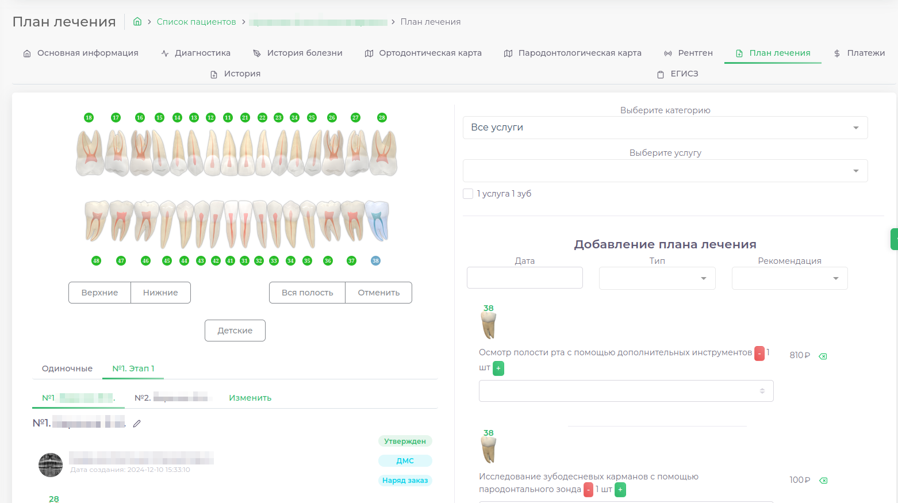

Модуль План лечения позволяет:  
 - Составить новый план лечения
 - Просмотреть уже составленные планы лечения
 - Распечатать документы, связанные с планом лечения (План лечения, Акт выполненных работ, ИДС и т.п.)

> [Как составить план лечения]
> [Как распечатать документ]  
> [Как составить групповой план лечения]
> [Как подобрать план лечения по заготовленному шаблону]

Модуль разделен на 4 блока: 

1. [Интерактивная зубная формула]
2. [Выбор Категории услуг и услуги]
3. [Список планов лечения]
4. [Список выбранных услуг]

## Зубная Формула

---  

В левой части экрана отображается интерактивная зубная формула. В формуле отражены ранее проставленные в модуле [Диагностика](docs/cardPatient/diagnoses.md) диагнозы.  

> [Как заполнить диагноз]

## Выбор услуг

---  

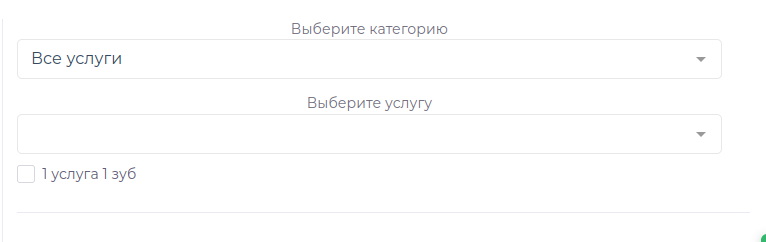  

В правой части экрана отображается 2 списка: 
1. Выбор категории - здесь можно выбрать категорию Прайс-Листа, это позволит выбрать услугу из конкретной категории. По умолчанию выбран весь прайс-лист.
2. Выбор услуги - здесь можно выбрать услугу, для составления плана лечения

## Список планов лечения

---  

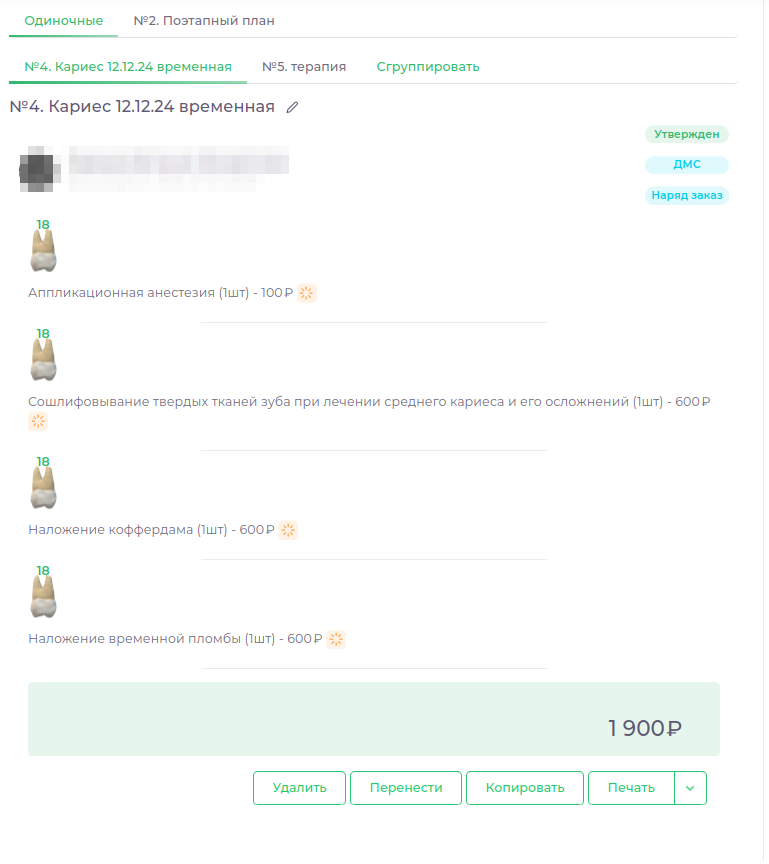  

В нижней левой части экрана отображается список Планов лечения.

| Элемент                                           | Пояснение                                         |
|---------------------------------------------------|---------------------------------------------------|
| 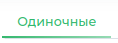     | Выбранный План лечения                            |
| 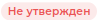 | Неутвержденный план лечения                       |
| 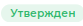   | Утвержденный план лечения                         |
| 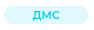      | Отправить план на согласование                    |
| 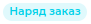    | Создать локальный наряд-заказ                     |
| 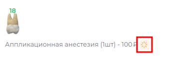      | На услугу не выставлен счет                       |
| 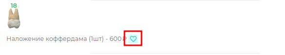       | На услугу выставлен счет                          |
| 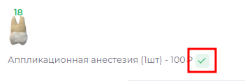      | Услуга оплачена пациентом                         |
| 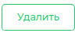            | Удалить план лечения                              |
| 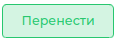       | Перенести план лечения в группу                   |
| 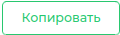           | Скопировать план лечения                          |
| 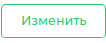           | Изменить план лечения                             |
| 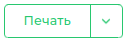          | Распечатать документы, связанные с планом лечения |

## Список выбранных услуг

---

  

В правой части услуг отображается список выбранных при составлении плана услуг с номером Зуба, стоимостью услуги, количеством услуг.

