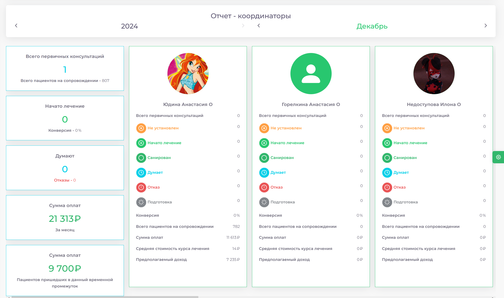
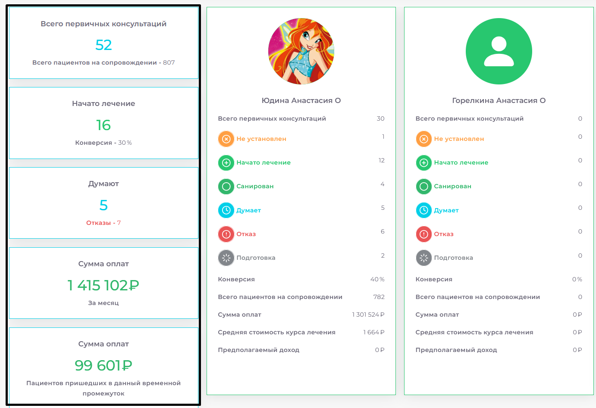
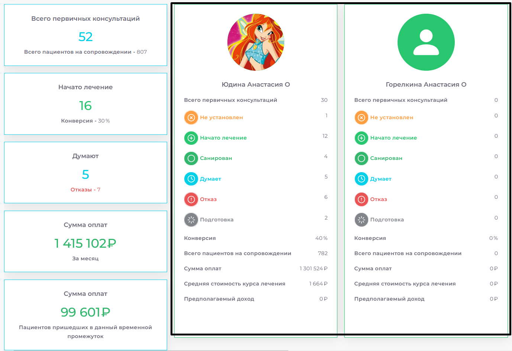

# Отчет

## Интерфейс

> В верхней части модуля есть возможность указать период времени для ананлиза. Слева расположен столбец сводной информации по по указанному периоду для всех координаторов. В следующих блоках указаны данные для каждого отдельного координатора.

### Общая статистика по всем координаторам

* **Всего первичных консультаций:** Количество первых обращений пациентов в клинику.
* **Всего пациентов на сопровождении:** Общее количество активных пациентов, закрепленных за координаторами.
* **Начато лечение:** Число пациентов, которые начали лечение.
* **Конверсия:** Процент пациентов, начавших лечение после консультации.
* **Думают:** Пациенты, которые еще не приняли решения.
* **Отказы:** Пациенты, которые отказались от лечения.
* **Сумма оплат:** Финансовые поступления от лечения пациентов за указанный период.

### Индивидуальная статистика по координаторам

Каждый координатор представлен в отдельной карточке с детальной информацией:

**Стадии пациентов:**

    * Не установлен (статус не определен).
    * Начато лечение
    * Санирован (пациент завершил лечение).
    * Думают
    * Отказ
    * Подготовка (пациенты в процессе подготовки к лечению).

**Конверсия:**  Рассчитывается индивидуально исходя от самого координатора.
Всего пациентов на сопровождении: сколько ведет пациентов данный координатор.

**Финансовые данные:**

    * Сумма оплат за месяц.
    * Средняя стоимость курса лечения.
    * Предполагаемый доход.
