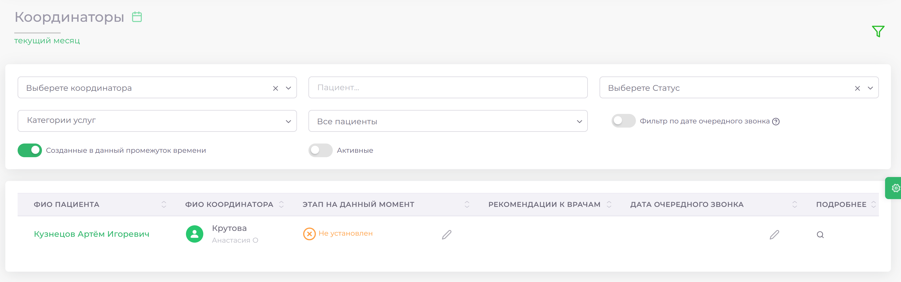

# Координаторы

|Элемент| Описание|
|-------|---------|
|Поле **«Выберите координатора»**| Позволяет выбрать конкретного координатора для отображения пациентов, закрепленных за ним.|
|Поле **«Пациент»**| Используется для поиска данных по конкретному пациенту.|
|Поле **«Категории услуг»**| Сужает поиск по определенной категории услуг (например, терапия, хирургия).|
|Поле **«Выберите статус»**| Фильтрует пациентов по статусам, Упрощает контроль за текущими задачами и взаимодействием с пациентами.|
|Переключатель **«Созданные в данный промежуток времени - Активные в данный промежуток времени»**| Нужен для отображения только тех записей, которые были созданы или активны в выбранный период.|
|Переключатель **«Активные»**| Показывает только записи, относящиеся к активным пациентам.|
|Переключатель **«Фильтр по дате очередного звонка»**| Включение фильтра отбирает записи с учетом назначенных дат следующего звонка.|
 

