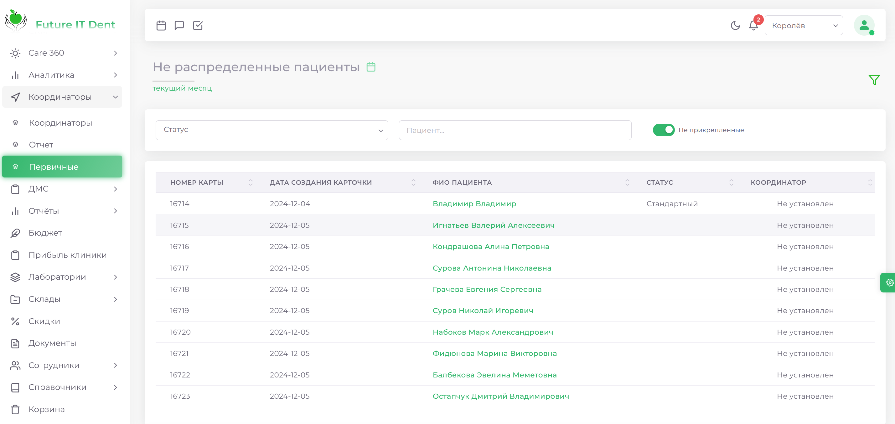

# Первичные

В данном модуле есть фильтр, по которым можно выбрать следующие параметры:

**Выпадающий список**, позволяющий отобрать пациентов по их статусу.  
**Поле поиска**: строка поиска по ФИО пациента. 
Ползунок "**Не прикрепленные**": позволяет показывать только пациентов, не привязанных к конкретному координатору. 

