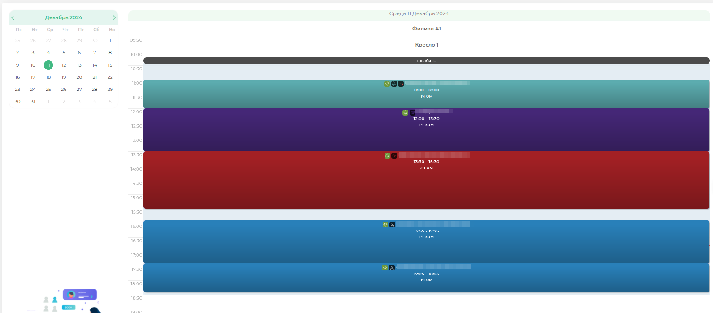

# Расписание врачей

> Модуль «Распиание врачей» предназначен только для врачей. Каждый доктор видит своё рабочее расписание.

>При открытии модуля расписание врачей, вверху с левой стороны будет мини-календарь.

>**Мини-календарь** — предназначен, чтобы выбрать определенную дату для просмотра расписания.