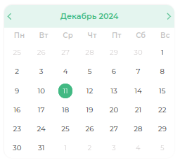

# Расписание врачей

>Модуль «Распиание врачей» предназначен только для врачей. Каждый доктор видит своё рабочее расписание.

>При открытии модуля расписание врачей, вверху с левой стороны будет мини-календарь.

>**Мини-календарь** — предназначен, чтобы выбрать определенную дату для просмотра расписания.

>Основным блоком является расписание с креслом/креслами и записями на приём.

>В каждой записи указано: ФИО пациента, время приёма и продолжительность. При наведении на запись, появится небольшое окно с информацией.

> В записи на приём можно изменить статус приёма и/или комментарий к записи. Для этого нужно нажать на правую кнопку мыши по записи и появится окошко.

| Кнопка                                         | Инструкция                    |
|------------------------------------------------|-------------------------------|
|  | Изменить статус приёма        |
|            | Изменить комментарий к записи |
