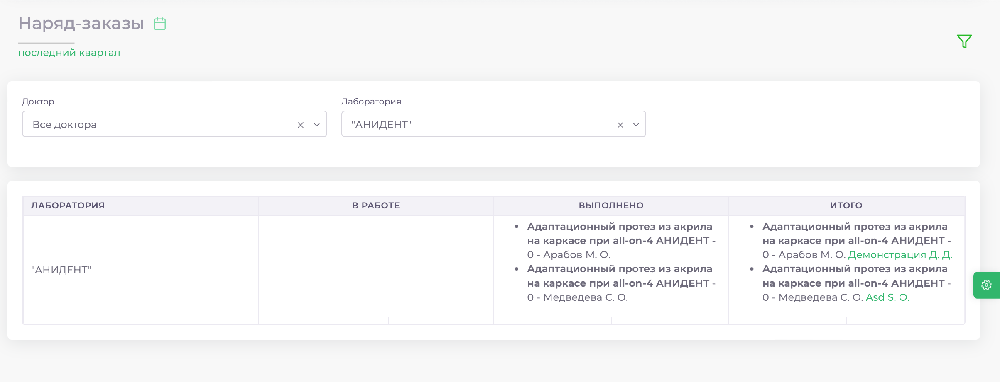
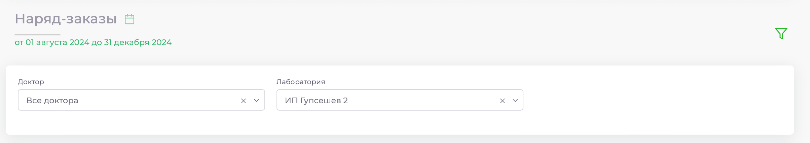
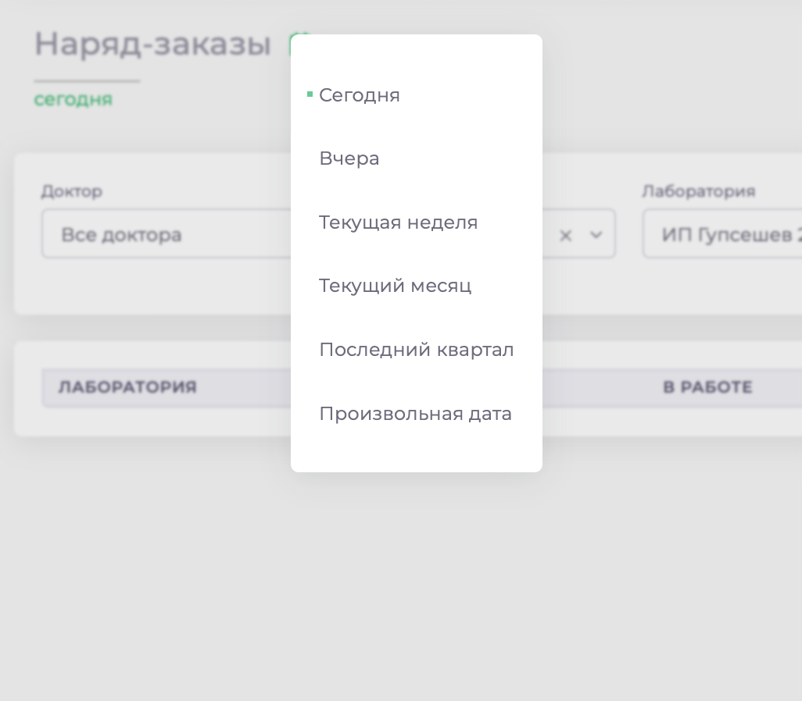
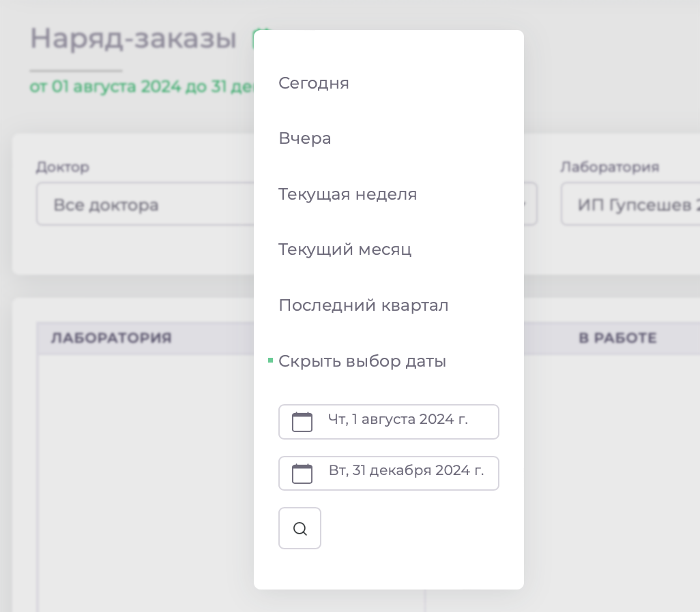
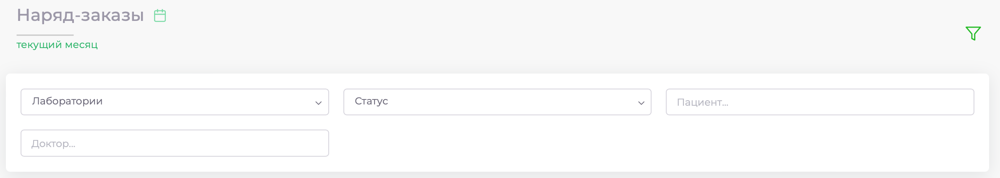
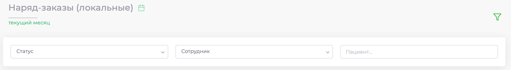
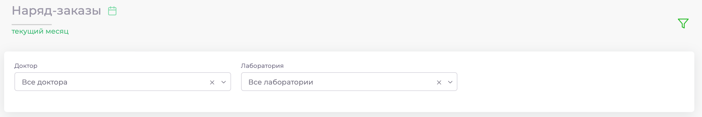

# Итоговая таблица

Модуль "Итоговая таблица" представляет удобную сводку по всем созданным наряд-заказам для лабораторий. Для удобства просмотра доступны фильтры:

* **Фильтр по дате**: Нажмите на значок календаря и выберите нужный период.
* **Фильтр по врачу** или лаборатории: Нажмите на значок воронки и выберите нужного врача или лабораторию.

## СОРТИРОВКА ПО ДАТЕ 

В разделах **Наряд-заказы**, **Наряд-заказы (локальные)** и **Итоговая таблица**, вы можете выводить записи за определенные даты. Вам доступны варианты: сегодня, вчера, текущая неделя, текущий месяц, последний квартал и произвольная дата. 

Для этого нажмите на значок календаря в верхней части экрана.

В случае выбора произвольной даты станут доступны дополнительные поля начала и окончания периода. Для применения настроек нажмите на кнопку поиска (увеличительное стекло). 

Увидеть за какой период выводятся записи можно под календарём. 

## ГРУПИРОВКА СПИСКА ЗАПИСЕЙ

В разделах **Наряд-заказы**, **Наряд-заказы (локальные)** и **Итоговая таблица**, доступны поля для группирования записей. Для этого нажмите на кнопку «воронки» в правом верхнем углу.  

В разных разделах поля будут отличаться. Соответственно для раздела **Наряд-заказы** доступны группы заказов по лаборатории, статусу, пациенту и врачу; для **Наряд-заказа (локальные)** – по статусу, сотруднику и пациенту; для **Итоговой таблицы** – по врачу и лаборатории.

