# Лаборатории

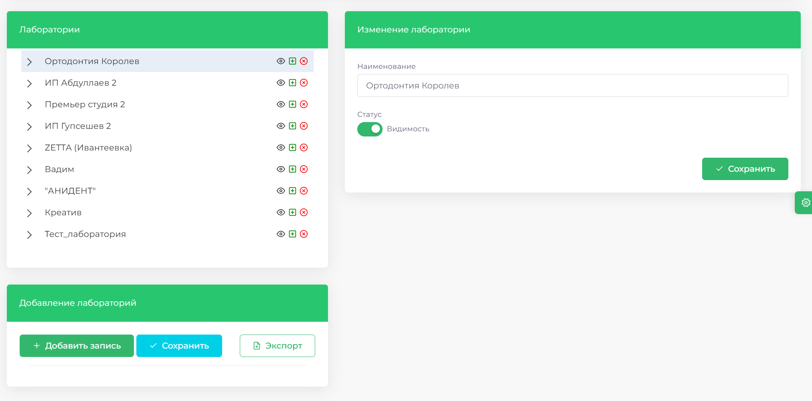

> На главной странице модуля представлен список всех лабораторий, с которыми работает клиника. 

|Элемент| Описание|
|-------|---------|
||Открыть окно просмотра прайс-листа лаборатории|
||Добавить прайс-лист в лабораторию |
||Удалить лабораторию или услугу из прайс-листа|
||Кнопка для экспорта данных в excel-документ|
||Кнопка для экспорта данных в excel-документ|

## Просмотр прайс-листа лаборатории

>1. Перейдите в раздел Лаборатории => Лаборатории
>2. Выберите нужную лабораторию

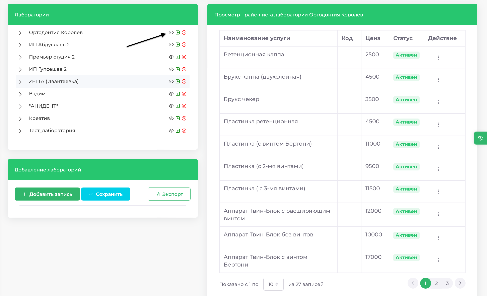

>3. Нажмите на кнопку Глаз, чтобы увидеть все доступные услуги и их цены

## Добавление лаборатории

>1.	Перейдите в раздел Лаборатории => Лаборатории

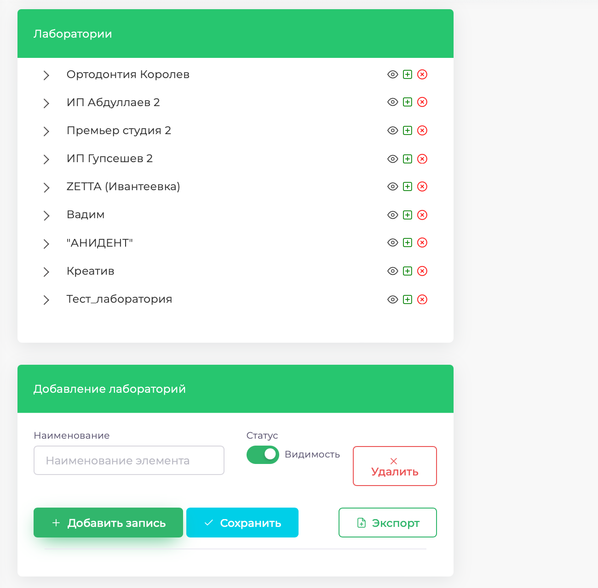

>2.	Нажмите кнопку Добавить запись

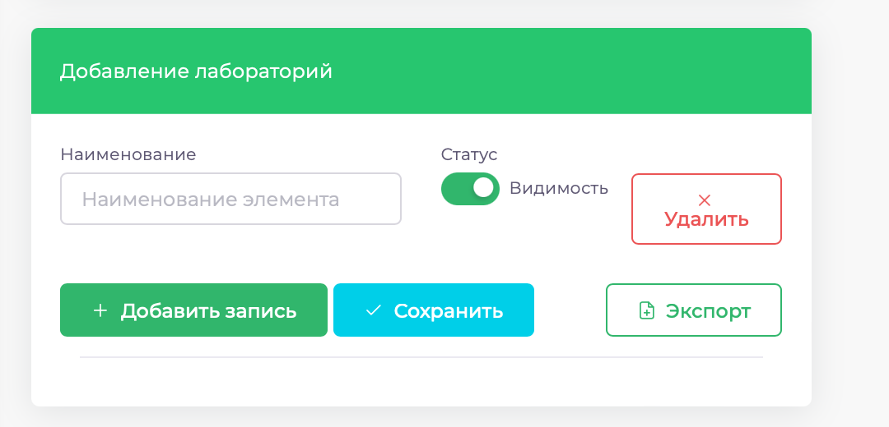

>3.	Введите название лаборатории и нажмите Сохранить

 
## Удаление лаборатории

>1.	Откройте раздел Лаборатории => Лаборатории

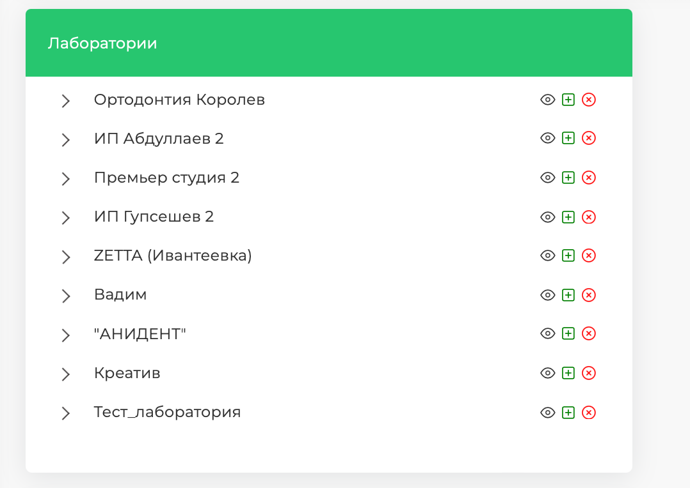

>2.	Выберите лабораторию, которую нужно удалить.
>3.	Справа от названия нажмите на значок красного крестика.

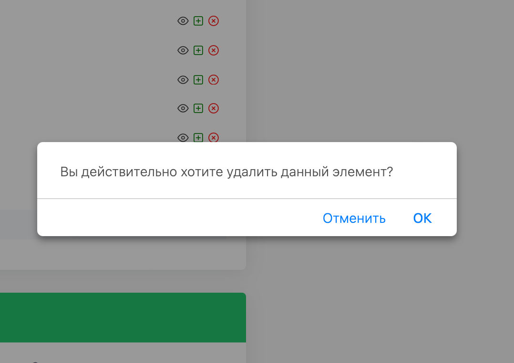

>4.	Подтвердите удаление, нажав **ОК**.

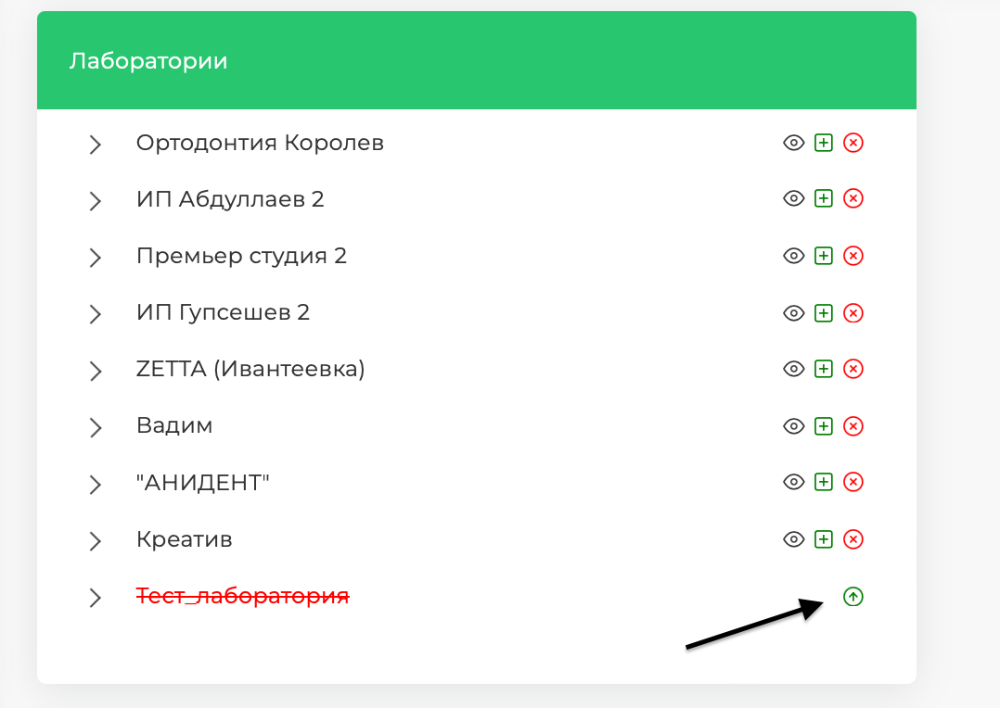

>5.	До обновления страницы, удалённая лаборатория останется в общем списке и при необходимости, вы сможете восстановить её

## Изменение названия лаборатории

>1.	Зайдите в раздел Лаборатории => Лаборатории

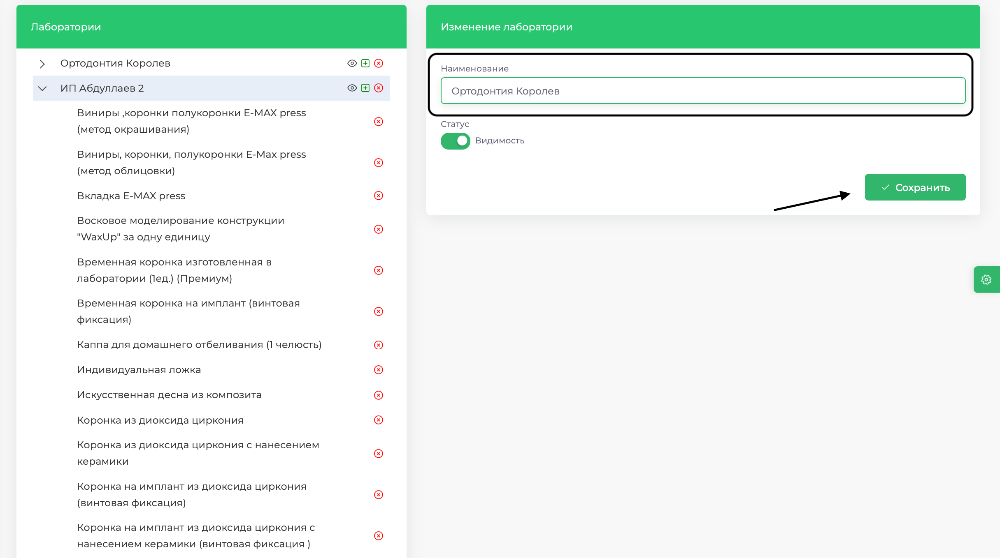

>2.	Выберите лабораторию и нажмите на её название
>3.	Измените название и нажмите кнопку Сохранить

## Добавление услуги в лабораторию

>1.	Откройте раздел Лаборатории => Лаборатории

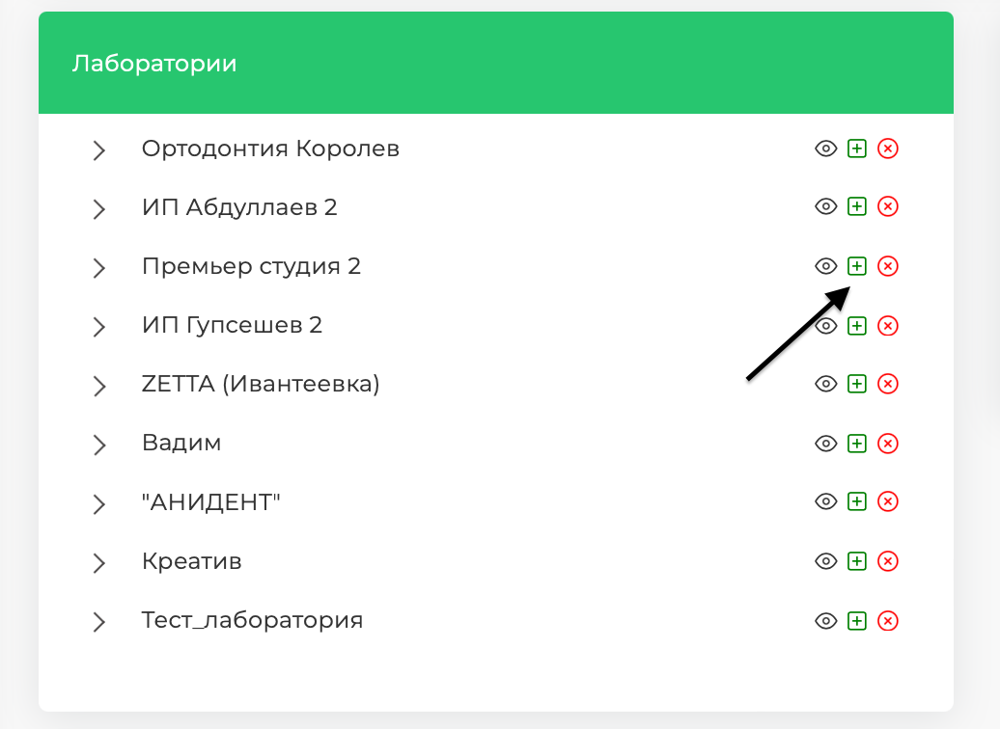

>2.	Выберите нужную лабораторию, нажмите на значок зелёного плюса

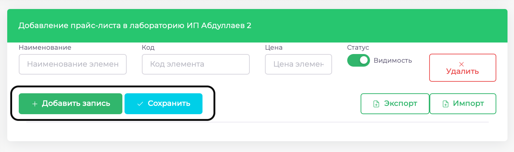

>3.	В правой части экрана нажмите Добавить запись, заполните поля и нажмите Сохранить

## Удаление услуги лаборатории

>1.	Перейдите в раздел Лаборатории => Лаборатории
>2.	Выберите лабораторию и услугу

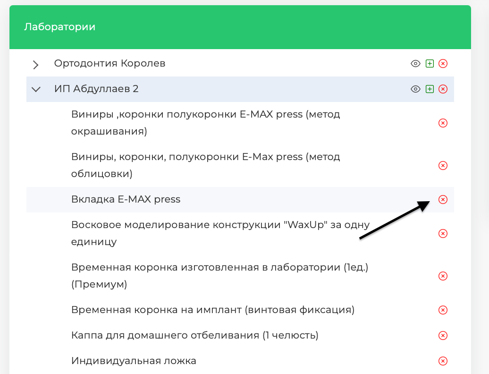

>3.	Справа от названия услуги нажмите на красный крестик
>4.	Подтвердите операцию

## Изменение названия и цены услуги лаборатории

>1.	Откройте раздел Лаборатории => Лаборатории
>2.	Выберите лабораторию и нажмите на нужную услугу

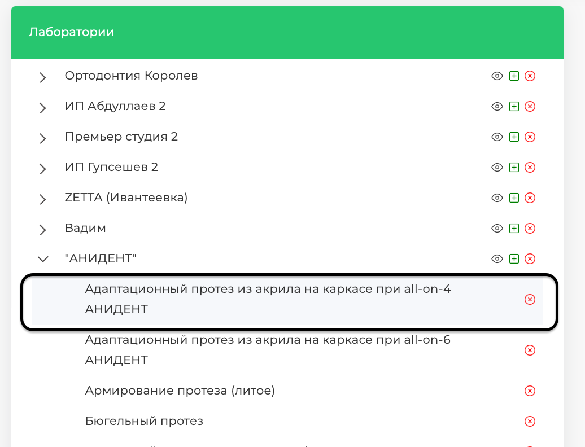

>3.	Внесите необходимые изменения цену

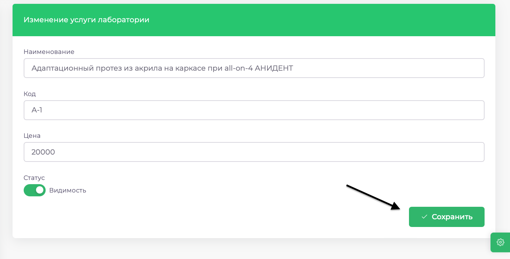

>4.	Нажмите Сохранить

