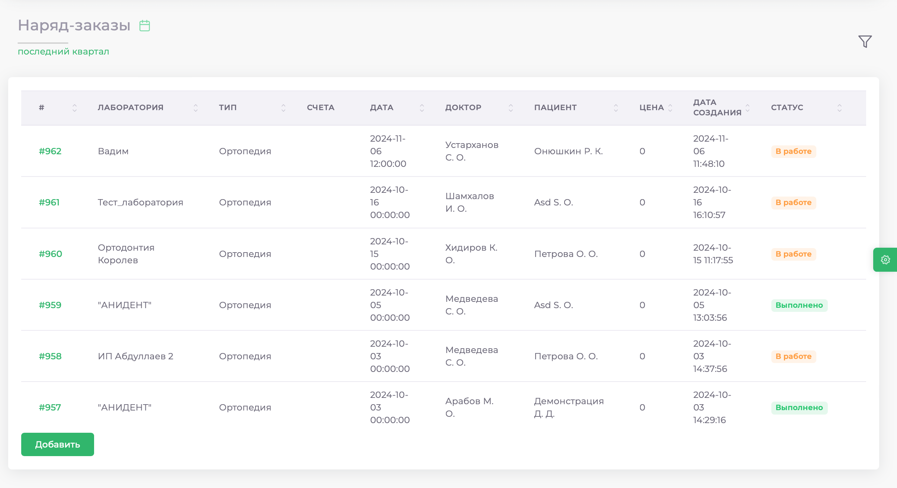
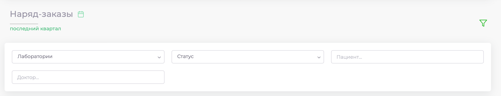
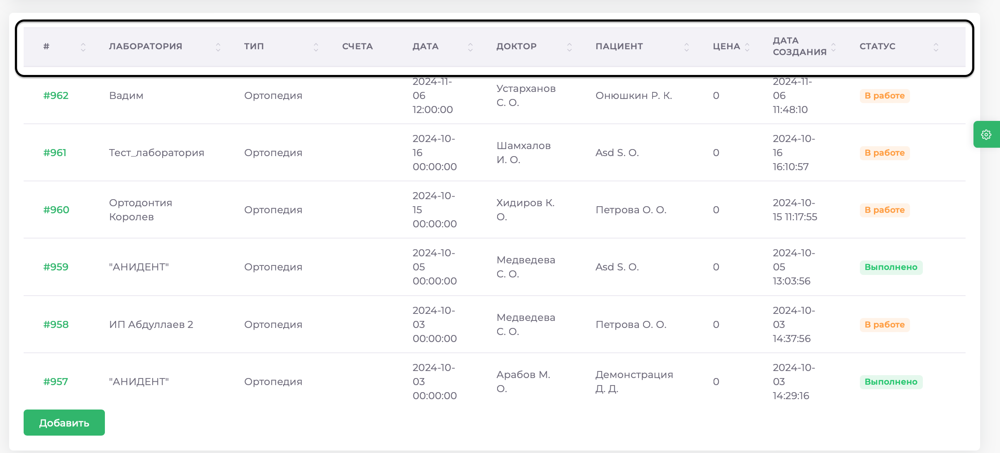
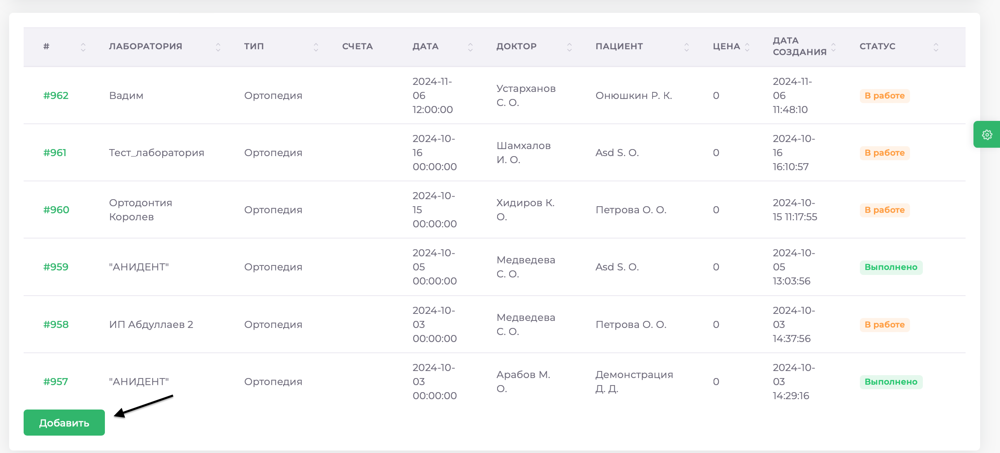
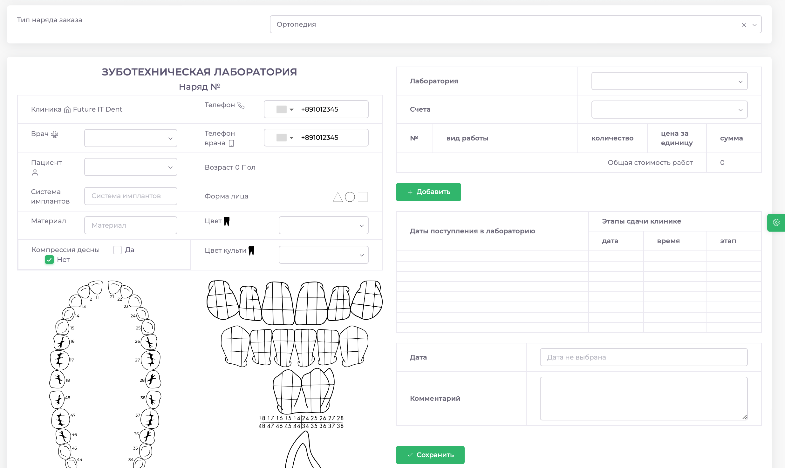
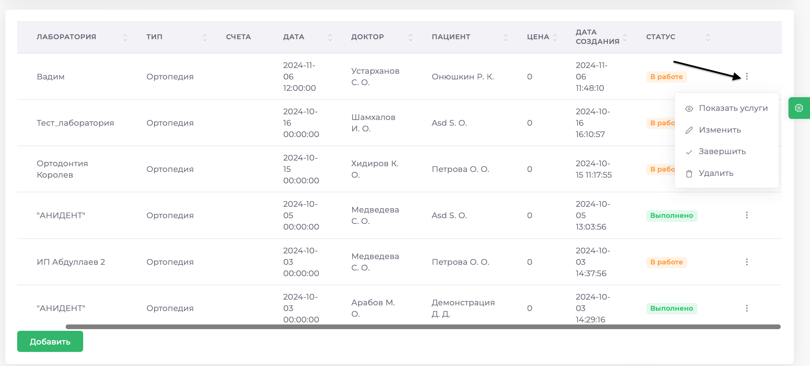
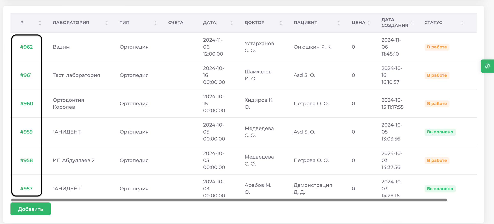
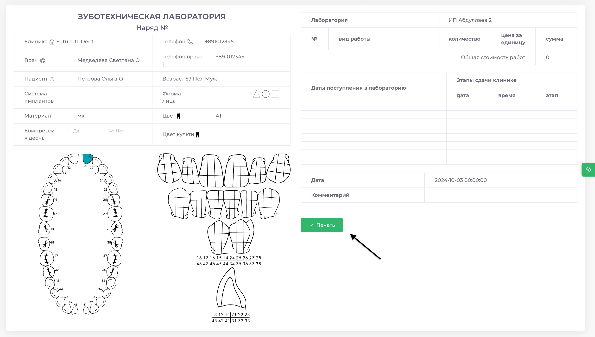
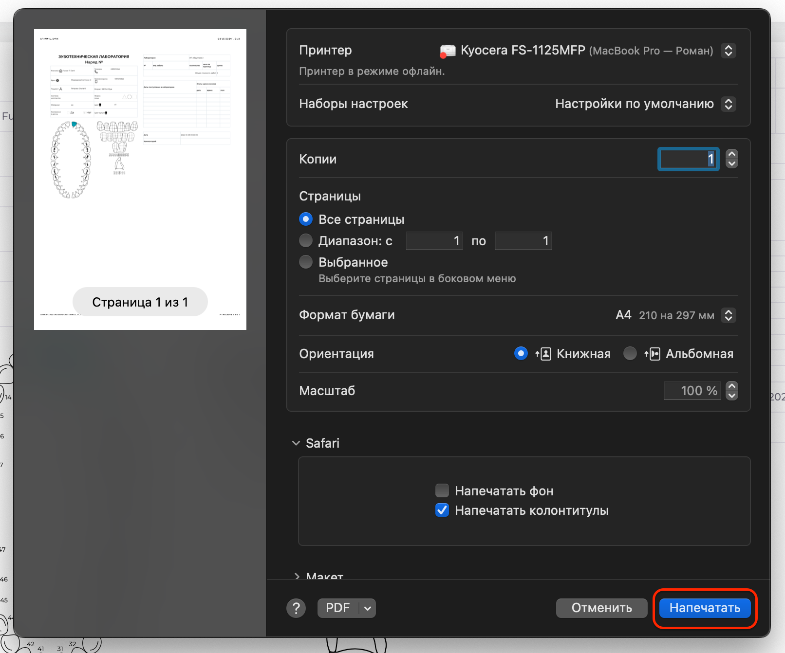
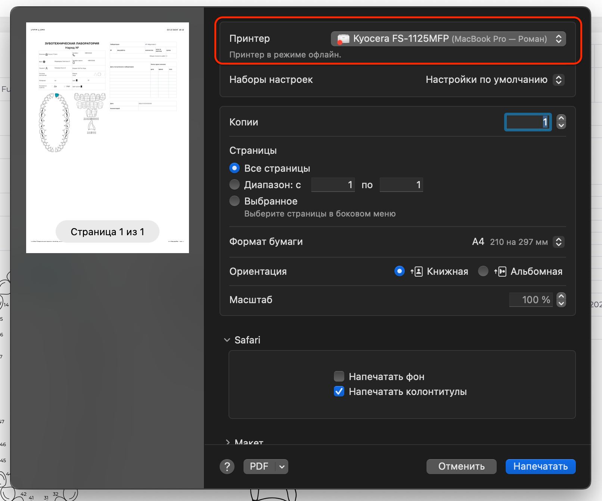

# Наряд-заказы

Модуль "Наряд-заказы" предоставляет возможность создания, просмотра и удаления всех наряд-заказов, созданных для лабораторий-партнёров. Для удобства работы с наряд-заказами доступны фильтры по следующим параметрам:

* Дата создания
* Название лаборатории
* Статус выполнения
* ФИО пациента
* ФИО лечащего врача
 
 

Также вы можете сортировать записи нажатием название полей (#, **Лаборатория**, **Тип** и т.д.)
 
 

## Создание наряд-заказа

1.	Зайдите в раздел **Лаборатории** => **Наряд-заказы**
2.	Нажмите кнопку **Добавить**

 

3.	Заполните необходимые поля

 

4.	На изображениях выберите зуб/его часть, для которой заказывается материал, нажатием левой кнопки мыши
5.	Нажмите кнопку **Сохранить**

 
## Редактирование наряд-заказа

 

### Для удаления наряд-заказа:

1.	Откройте раздел **Лаборатории** => **Наряд-заказы**
2.	Выберите нужный наряд-заказ и нажмите на кнопку с тремя точками справа
3.	В появившемся окне нажмите **Удалить**

### Чтобы просмотреть услуги, включенные в наряд-заказ:

1.	Откройте раздел **Лаборатории** => **Наряд-заказы**
2.	Выберите нужный наряд-заказ и нажмите на кнопку с тремя точками справа
3.	В появившемся окне нажмите **Показать услуги**

### Для редактирования наряд-заказа:

1.	Перейдите в раздел **Лаборатории** => **Наряд-заказы**
2.	Выберите нужный наряд-заказ и нажмите на кнопку с тремя точками справа
3.	Нажмите Изменить, внесите изменения и нажмите **Сохранить**

### Чтобы изменить статус выполнения наряд-заказа:

1.	Зайдите в раздел **Лаборатории** => **Наряд-заказы**
2.	Выберите нужный наряд-заказ и нажмите на кнопку с тремя точками справа
3.	В появившемся окне выберите **Завершить** или **В работу**

## Печать наряд-заказа

1. Перейдите в раздел **Лаборатории** => **Наряд-Заказы**, выберете необходимый и нажмите на его номер

 
 
2. В открывшемся окне, нажмите кнопку **Печать**

 

3. В окне настроек, нажмите на кнопку **Печать**

 

4. Также вы можете выбрать принтер для печати, если их больше одного или сохранить документ наряд-заказа в формате PDF. 
Для этого воспользуйтесь полем **Принтер**

 

 

