# Мои задачи

>Модуль «Мои задачи» — это один из ключевых инструментов для эффективного управления задачами внутри клиники. Благодаря удобному и интуитивно понятному интерфейсу, он позволяет легко назначать задачи, редактировать их, отслеживать их статус и распределять их между сотрудниками клиники. 

>Для облегчения работы модуль также включает несколько инструментов фильтрации, которые помогают быстро находить нужные задачи, что особенно важно при большом объеме данных.

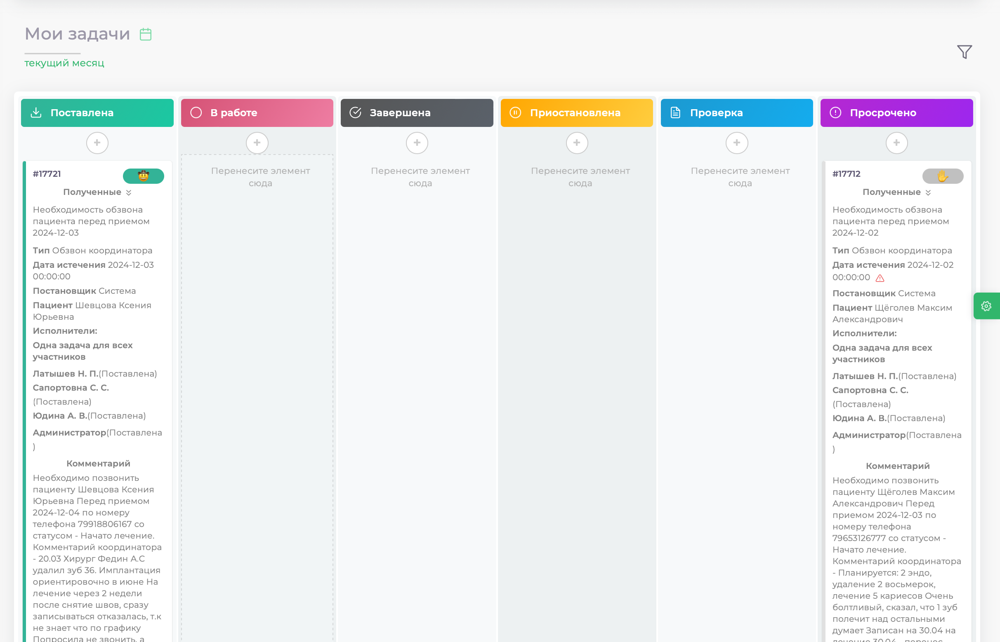

В верхней части расположены разнообразные фильтры, которые помогут упростить поиск задач.

**Фильтр по времени**

Этот инструмент позволяет выбрать нужный период времени для отображения задач. Вы можете задать конкретную дату, чтобы отобразить задачи, созданные или поставленные в выбранный период. Это очень удобно для планирования и анализа выполнения задач за день, неделю или месяц.

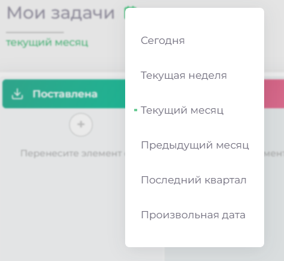

### Фильтр по параметрам ###

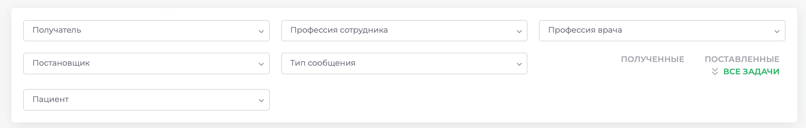

Для более точного поиска и отображения задач модуль включает фильтр по различным параметрам. Нажмите значок воронки и выберите один или несколько критериев для фильтрации:

1.	Получатель
2.	Постановщик
3.	Профессия сотрудник
4.	Тип сообщения
5.	Профессия врач
6.	Пациент

**Фильтр по филиалам**

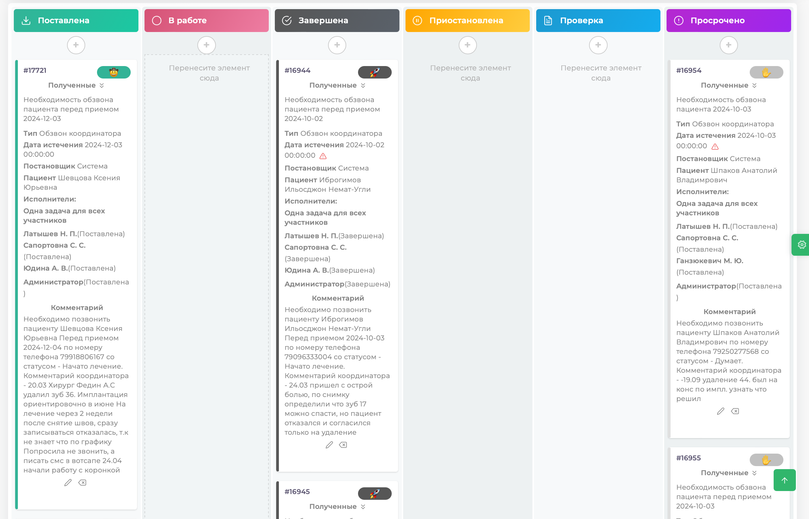

Этот фильтр предназначен для выбора конкретного филиала, если ваша клиника состоит из нескольких подразделений. С его помощью можно отсортировать задачи по филиалу и просматривать только те, которые относятся к выбранному подразделению.

Основную часть экрана занимает блок самих задач, разделённых по статусам: **Поставлена, В работе, Завершена, Приостановлена, Проверка** и **Просрочено**. Каждая задача представлена карточкой с информацией и порядковым номером. 

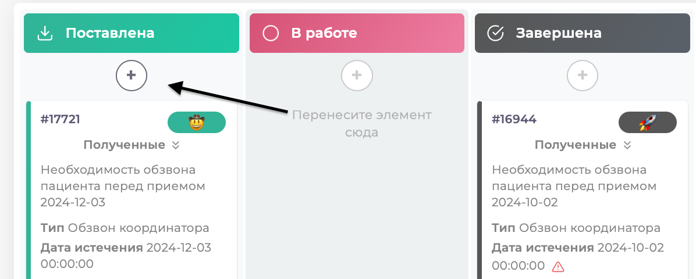

Модуль "Мои задачи" также выполняет важнейшую функцию — постановку задач для сотрудников клиники. Он позволяет создавать задачи, указывая ответственных сотрудников или целые группы.

## Поставновка задачи

>1. Нажмите круглую кнопку "добавить" в верхней части экрана.

 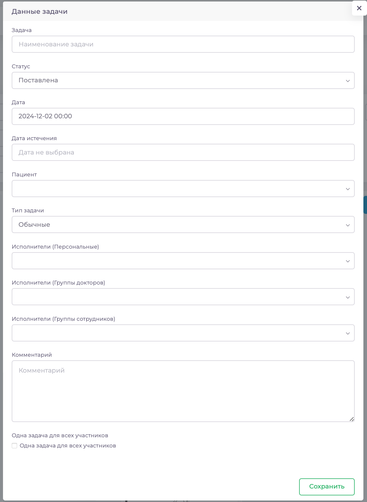

>2. Заполните поля для постановки задачи. 
 
 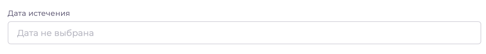

>Важно правильно указать исполнителей, используя следующие категории:
*	**Исполнители (Персональные)** — для назначения задачи конкретному сотруднику или нескольким сотрудникам независимо от их должности.
*	**Исполнители (Группы докторов)** — для назначения задачи группе врачей определённой специальности.
*	**Исполнители (Группы сотрудников)** — для назначения задачи группе сотрудников (например, администраторам или координаторам).

>3. Также можно указать **дату истечения**, чтобы задача автоматически перемещалась в колонку "Просрочено" после указанного срока.

 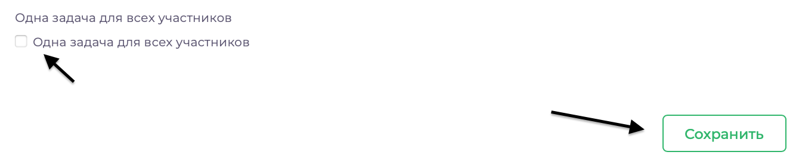

>4. После заполнения всех полей нажмите кнопку **Сохранить**. На этом этапе задача будет создана, сохранена и автоматически отображена у всех сотрудников, которым она была поставлена.
 
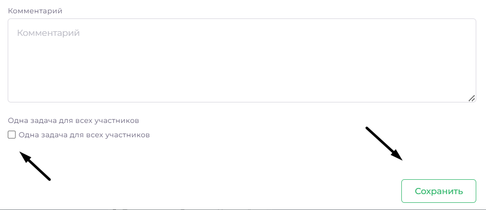

>Если вы являетесь создателем задачи и одновременно её исполнителем, а задача поставлена группе сотрудников, вы можете выбрать опцию **Одна задача для всех сотрудников**, чтобы задача отображалась у вас только один раз.

## Удаление и изменение задачи

>1. Зайдите в раздел **Мои задачи**, найдите требуемую задачу.
>2. Для удаления: нажмите на значок с крестиком.

 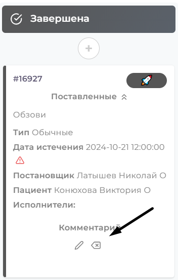

>3. Для изменения: нажмите на значок карандаша. 

 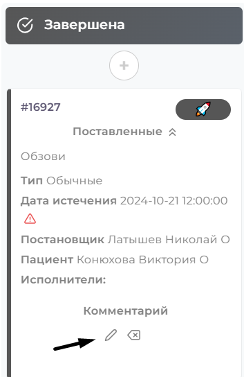

>В открывшемся окне измените все необходимые поля.

 

>4. Нажмите **Сохранить**.

## Изменить статус задачи

>В процессе работы задачи могут проходить через различные статусы, такие как **поставлена**, **в работе**, **на проверке** и так далее. Для управления статусами в модуле предусмотрены 6 отдельных блоков, каждый из которых соответствует определенному этапу выполнения задачи.

>1. Наведите курсор на задачу.

>2. Удерживая левую кнопку мыши, переместите задачу в соответствующий блок статуса.

 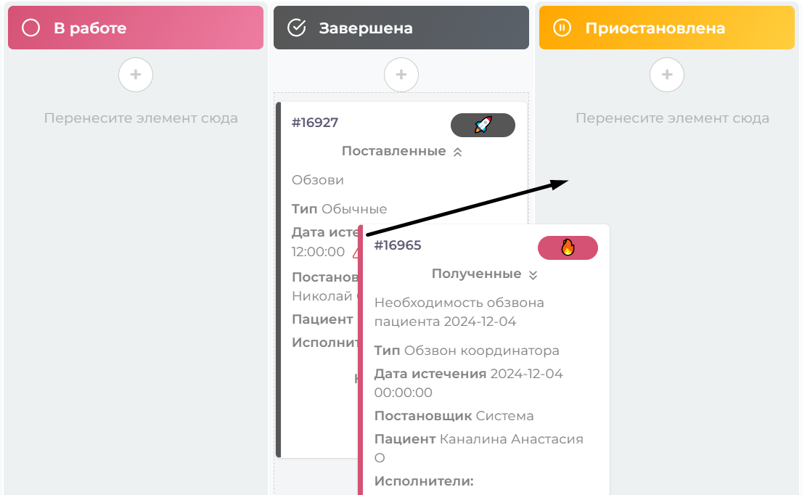
 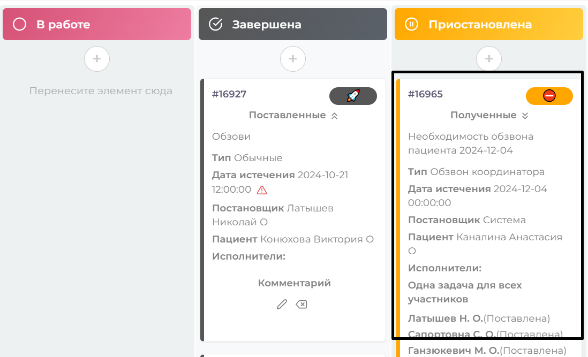

>3.  Если в столбце больше одной задачи, таким же образом можете определять какая задача будет выше или ниже.  

