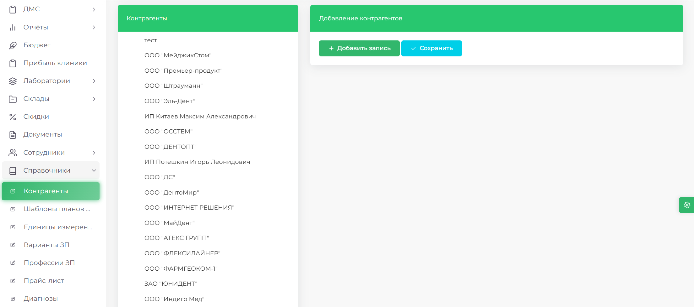
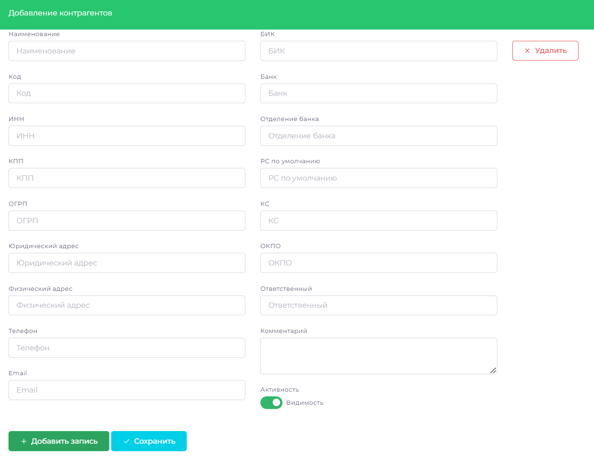
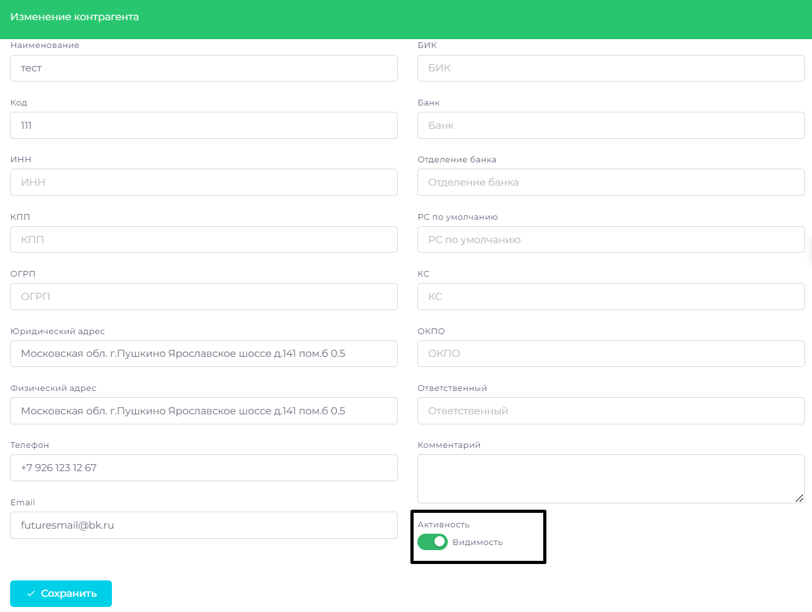
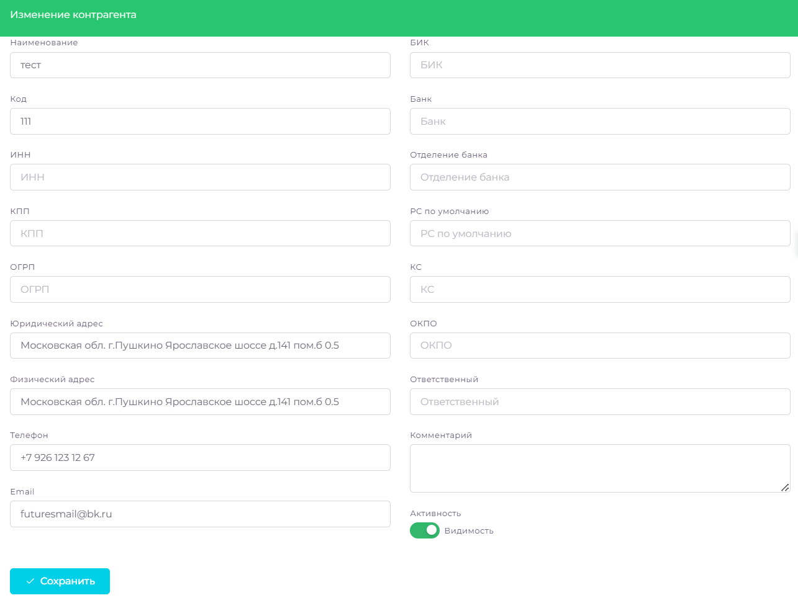

# Контрагенты

>В модуле **СПРАВОЧНИКИ** доступна возможность добавления, удаления и редактирования данных, которые используются во многих других модулях системы. Раздел **КОНТРАГЕНТЫ** предназначен для управления контрагентами (поставщиками расходных материалов). Вы можете добавлять новых контрагентов, удалять ненужных, а также изменять их данные.
Материалы/Наряд-заказы

## Добавить контрагента

1. Перейдите в раздел **Справочники** => **Контрагенты**
2. Нажмите кнопку Добавить запись

3. Введите необходимые данные поставщика

4. Нажмите Добавить запись

## Скрыть контрагента

1. Перейдите в раздел **Справочники** => **Контрагенты**
2. Выберите контрагента, которого хотите скрыть из поиска

3. Нажмите на переключатель «Активность», чтобы деактивировать контрагента
4. Нажмите **Сохранить**

## Изменить данные контрагента

1. Перейдите в раздел **Справочники** => **Контрагенты**
2. Выберите контрагента, информацию о котором необходимо изменить
3. Внесите изменения в поля с данными поставщика

4. Нажмите **Сохранить**

