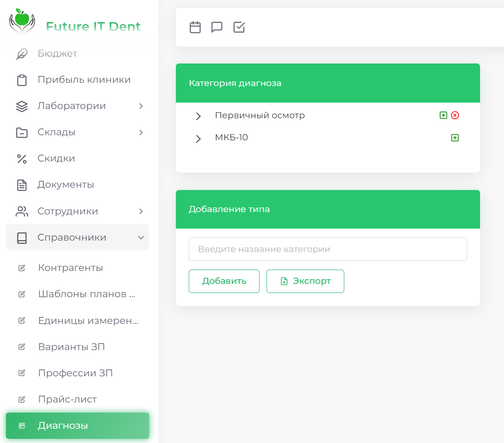
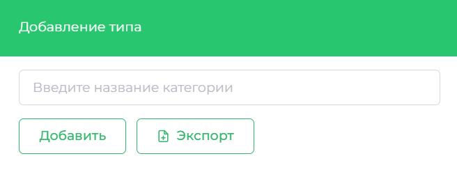
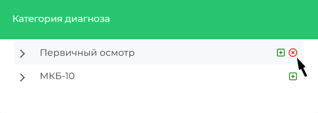
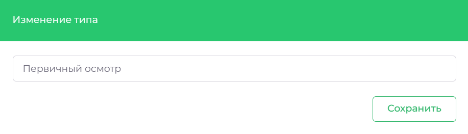
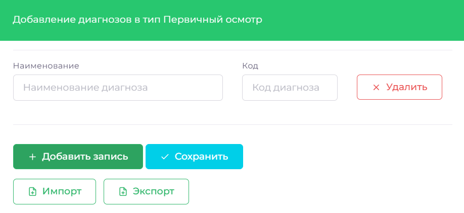
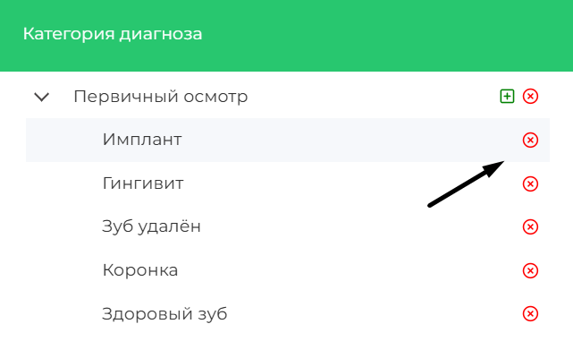
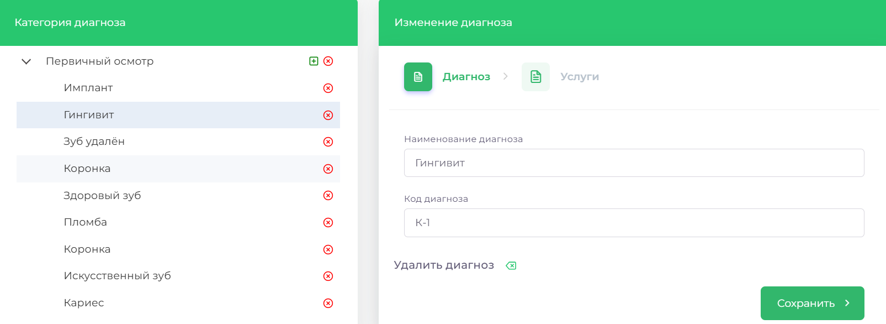

# Диагнозы

Раздел предоставляет возможность управлять категориями диагнозов и самими диагнозами. Вы можете добавлять, изменять или удалять категории диагнозов, а также редактировать конкретные диагнозы в рамках этих категорий. В дальнейшем, вы сможете их увидеть в разделе Диагностика, Карточки пациента.

## Как добавить категорию диагнозов

1. Зайдите в раздел **Справочники** => **Диагнозы**
2. Перейдите к блоку **Добавление типа**

3. Введите название категории диагнозов и нажмите кнопку **Добавить**

## Как удалить категорию диагнозов

1. Откройте раздел **Справочники** => **Диагнозы**
2. Выберите нужную категорию диагноза
3. Справа от названия нажмите на **красный крестик**

4. В появившемся окне нажмите **ОК**, чтобы подтвердить удаление

## Как изменить название категории диагнозов

1. Перейдите в раздел **Справочники** => **Диагнозы**
2. Выберите категорию, которую хотите изменить, и нажмите на её название

3. Внесите изменения в поле названия и нажмите **Сохранить**

 
## Как добавить диагноз

1. Зайдите в раздел **Справочники** => **Диагнозы**
2. Выберите нужную категорию, в которую хотите добавить диагноз
3. Справа от названия категории нажмите кнопку Добавить запись и заполните все необходимые поля

4. Нажмите кнопку **Сохранить**

## Как удалить диагноз

1. Откройте раздел **Справочники** => **Диагнозы**
2. Выберите категорию и нужный диагноз, который вы хотите удалить
3. Нажмите на диагноз, а затем нажмите на **красный крестик**

4.	Подтвердите удаление, нажав **ОК**

## Как изменить диагноз

1. Перейдите в раздел **Справочники** => **Диагнозы**
2. Выберите категорию и нужный диагноз

3. Внесите необходимые изменения
4. Нажмите **Сохранить**
