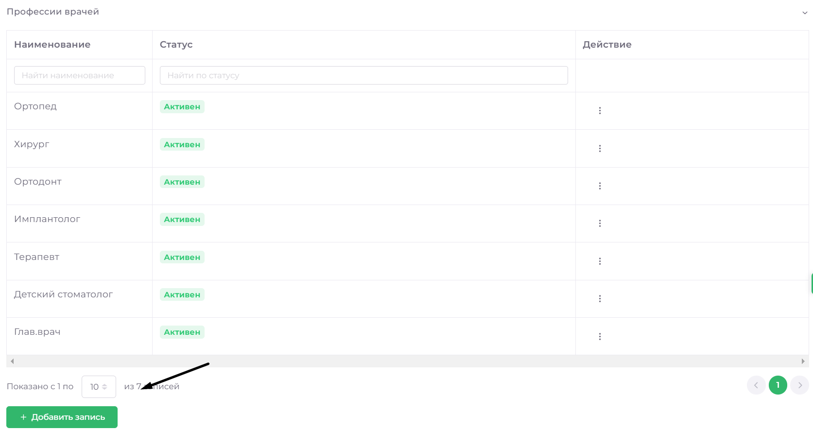

# Общее назначение

Этот раздел предоставляет возможность добавлять, изменять и удалять различные справочники, связанные с пациентами, сотрудниками и другими параметрами работы клиники.

**В ДАННОМ РАЗДЕЛЕ МОЖНО УПРАВЛЯТЬ:**

* Полом пациентов.
* Профессиями врачей и сотрудников.
* Родительскими диагнозами.
* Страховыми компаниями.
* Маркетинговыми каналами.
* Группами пациентов (CLV-группы).
* Филиалами (для добавления/удаления филиалов необходимо связаться с отделом продаж).

## Пол пациентов

Перейдите в раздел **Справочники **=> **Общее назначение**, выберете пункт **Пол**.

**Добавить запись**
Чтобы добавить вариант пола пациента, нажмите **Добавить запись**, введите значение и нажмите **Сохранить**

**Изменить запись**
 Выберете запись, которую нужно изменить, нажмите на кнопку в поле «Действие» и выберете **Изменить**. Внесите необходимые изменения и в поле «Действие» нажмите на кнопку подтверждения.

**Удалить запись**
Выберете запись, которую нужно изменить, нажмите на кнопку в поле «Действие» и выберете **Удалить**. 

 
## Профессии врачей

Перейдите в раздел **Справочники** => **Общее назначение**, выберете пункт **Профессии врачей**.

**Добавить запись**
Чтобы добавить новую специальность врача, нажмите **Добавить запись**, введите специальность врача, измените статус при необходимости и нажмите **Сохранить**

**Изменить запись**
 Выберете запись, которую нужно изменить, нажмите на кнопку в поле «Действие» и выберете **Изменить**. Внесите необходимые изменения и в поле «Действие» нажмите на кнопку подтверждения.

**Удалить запись**
Выберете запись, которую нужно изменить, нажмите на кнопку в поле «Действие» и выберете **Удалить**. 

 
## Профессии сотрудников

Перейдите в раздел **Справочники** => **Общее назначение**, выберете пункт **Профессии сотрудников**.

**Добавить запись**
Чтобы добавить новую профессию сотрудников, нажмите **Добавить запись**, введите название, измените статус видимости при необходимости. Переключатель «Филиальность» определяет возможность создавать сотрудника данной профессии отдельно для каждого филиала. Сохраните изменения.

**Изменить запись**
 Выберете запись, которую нужно изменить, нажмите на кнопку в поле «Действие» и выберете **Изменить**. Внесите необходимые изменения и в поле «Действие» нажмите на кнопку подтверждения.

**Удалить запись**
Выберете запись, которую нужно изменить, нажмите на кнопку в поле «Действие» и выберете **Удалить**. 

 
## Типы приёмов по посещению

Типы приёмов указываются в разделе Календарь и активно применяются для автоматизации перемещения пациентов по воронкам CRM.

Перейдите в раздел **Справочники** => **Общее назначение**, выберете пункт **Типы приёмов по посещению**.

**Добавить запись**
Чтобы добавить новый тип приёма, нажмите **Добавить запись**, введите название, измените статус видимости при необходимости. Сохраните изменения.

**Изменить запись**
 Выберете запись, которую нужно изменить, нажмите на кнопку в поле «Действие» и выберете **Изменить**. Здесь доступно изменение названия, цвета и иконки приёма 
Подтвердите изменения в поле «Действие».

**Удалить запись**
Выберете запись, которую нужно изменить, нажмите на кнопку в поле «Действие» и выберете **Удалить**.
Маркетинговые каналы

## Маркетинговые каналы

указываются при создании карточек пациентов и используются для анализа и сегментации данных в разделе Аналитика и CRM.Аналитика
Перейдите в раздел **Справочники** => **Общее назначение**, выберете пункт **Маркетинговые каналы**.

**Добавить запись**
Чтобы добавить новый маркетинговый канал, нажмите **Добавить запись**, введите название, измените статус видимости при необходимости. Сохраните изменения.

**Изменить запись**
 Выберете канал, который нужно изменить, нажмите на кнопку в поле «Действие» и выберете **Изменить**. 
Подтвердите изменения в поле «Действие».

**Удалить запись**
Выберете запись, которую нужно изменить, нажмите на кнопку в поле «Действие» и выберете **Удалить**. 

## Группы пациентов

Группы пациентов указываются при создании карточек пациентов, используется для сегментации групп пациентов по скидочным программам.

Перейдите в раздел **Справочники** => **Общее назначение**, выберете пункт **Группы пациентов**.

**Добавить запись**
Чтобы добавить новую группу, нажмите **Добавить запись**, введите название, измените статус видимости при необходимости. Сохраните изменения.

**Изменить запись**
 Выберете группу, которую нужно изменить, нажмите на кнопку в поле «Действие» и выберете **Изменить**. 
Подтвердите изменения в поле «Действие».

**Удалить запись**
Выберете запись, которую нужно изменить, нажмите на кнопку в поле «Действие» и выберете **Удалить**. 

## Категория лечения

Типы приёмов указываются в разделе Календарь и активно применяются для автоматизации перемещения пациентов по воронкам CRM.

Перейдите в раздел **Справочники** => **Общее назначение**, выберете пункт **Категории лечения**.

**Добавить запись**
Чтобы создать новую категорию, нажмите **Добавить запись**, введите название, измените статус видимости при необходимости. Сохраните изменения.

**Изменить запись**
Выберете канал, который нужно изменить, нажмите на кнопку в поле «Действие» и выберете **Изменить**. 
Теперь вы можете изменить наименование категории, статус, иконку и цвет отображения в календаре, а также можете указать рекомендацию, которую пациент получит после приёма (настраивается в разделе Care360_Триггеры).
Подтвердите изменения в поле «Действие».

**Удалить запись**
Выберете запись, которую нужно изменить, нажмите на кнопку в поле «Действие» и выберете **Удалить**. 
