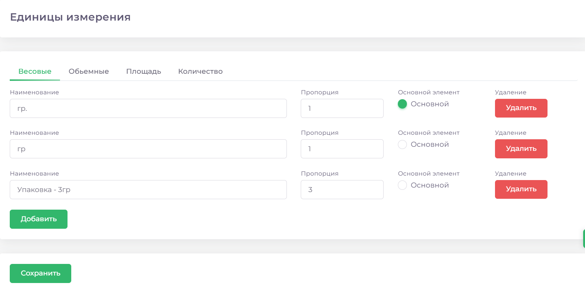
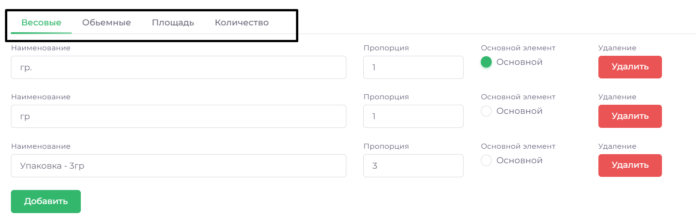
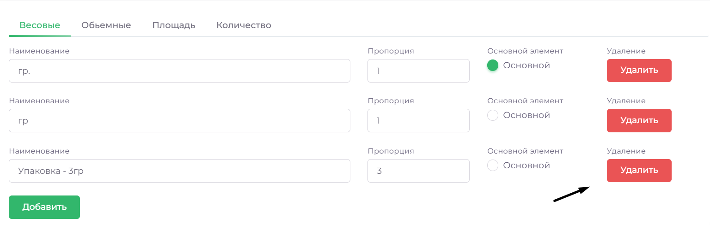
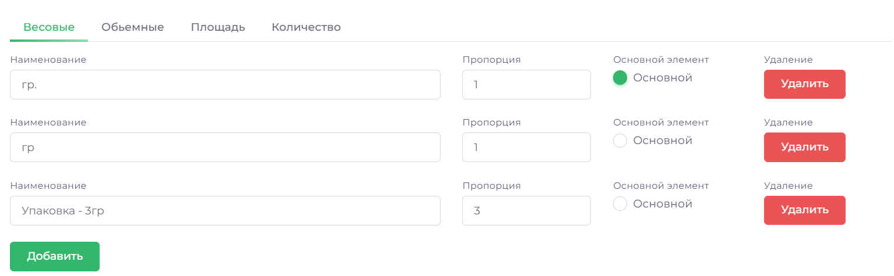

# Единицы измерения

В этом разделе можно добавлять, удалять и корректировать единицы измерения для расходных материалов (подробнее Склад-Материалы)

## Добавить единицу измерения

1. Зайдите в раздел **СПРАВОЧНИКИ** => **ЕДИНИЦЫ ИЗМЕРЕНИЯ**
2. Выберите нужный раздел по типу измерения расходного материала

3. Нажмите кнопку **ДОБАВИТЬ**, заполните поля и нажмите **СОХРАНИТЬ**

## Удалить единицу измерения

1. Зайдите в раздел **СПРАВОЧНИКИ** => **ЕДИНИЦЫ ИЗМЕРЕНИЯ**
2. Выберите нужный раздел по типу расходного материала

3. Нажмите **УДАЛИТЬ**, подтвердите действие, нажмите **СОХРАНИТЬ**

## Изменить единицу измерения

1. Зайдите в раздел **СПРАВОЧНИКИ** => **ЕДИНИЦЫ ИЗМЕРЕНИЯ**
2. Выберите нужный раздел

3. Внесите необходимые изменения и нажмите **СОХРАНИТЬ**

