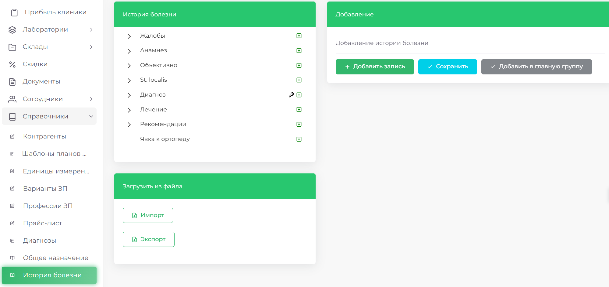
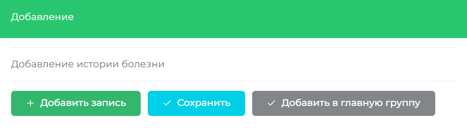
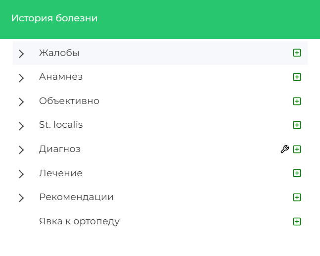
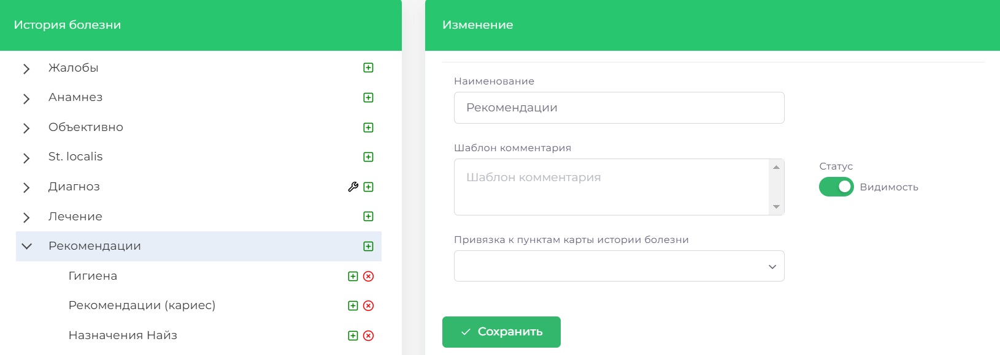
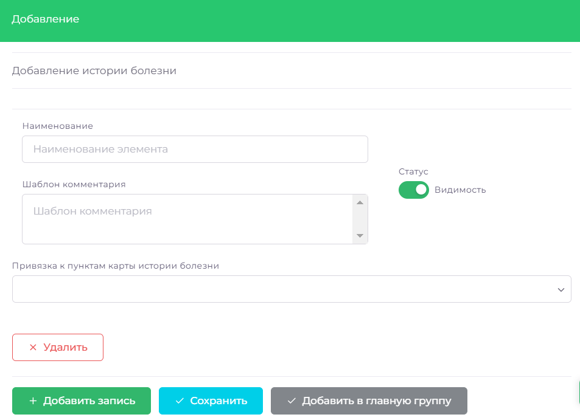

# История болезни

В разделе "История болезни" можно управлять шаблонами, которые используются для автоматизации составления медицинских записей в модуле "Карточка пациента". Здесь можно добавлять, изменять и удалять шаблоны диагнозов, рекомендаций и других элементов, связанных с историей болезни пациента.

## Работа с группами шаблонов

Перейдите в раздел Справочники => История болезни.

**Добавить группу шаблонов**
Чтобы создать новую категорию, нажмите **Добавить запись**, введите название новой группы. Сохраните изменения.

**Изменить название группы**
 Выберете группу, измените название в поле «Наименование» и сохраните изменения.

**Удалить запись**
1. Выберите нужную группу шаблонов.
2. Переведите переключатель из **зелёного** в **серый**, чтобы деактивировать группу.
3. Нажмите **Сохранить**.

 
## Работа с шаблонами
Перейдите в раздел **Справочники** => **История болезни**.

**Добавить шаблон**
Найдите группу шаблонов в которую хотите добавить новый шаблон. Нажмите на «зелёный плюс» справа от названия группы, далее **Добавить запись** заполните необходимые поля и нажмите **Сохраните**.

**Изменить название группы**
Выберите нужную группу шаблонов и шаблон внутри группы. Внесите необходимые изменения в поля и нажмите Сохранить

**Удалить запись**
Выберите нужную группу шаблонов и шаблон внутри этой группы. Справа от названия шаблона нажмите на  «**rрасный крестик**». Подтвердите удаление, нажав **ОК**

