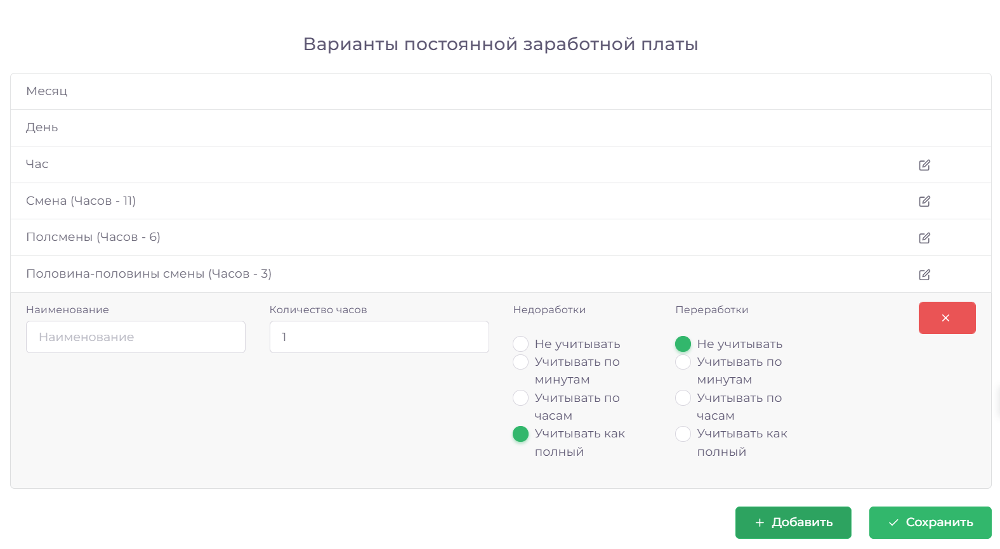

# Варианты ЗП

Раздел  предоставляет возможность добавления, удаления и корректировки вариантов заработной платы сотрудников.

## Как добавить вариант заработной платы

1.	Откройте раздел Справочники => Варианты заработной платы
2.	Нажмите кнопку Добавить, заполните необходимые поля и нажмите Сохранить

## Как удалить вариант заработной платы

1.	Перейдите в раздел Справочники => Варианты заработной платы
2.	Найдите нужный вариант и нажмите на значок с карандашом
3.	Отключите переключатель, переведя его из зелёного в серый, и нажмите Сохранить

## Как изменить вариант заработной платы

1.	Откройте раздел Справочники => Варианты заработной платы
2.	Выберите вариант, который нужно изменить, нажмите на значок с карандашом
3.	Внесите изменения и нажмите Сохранить

