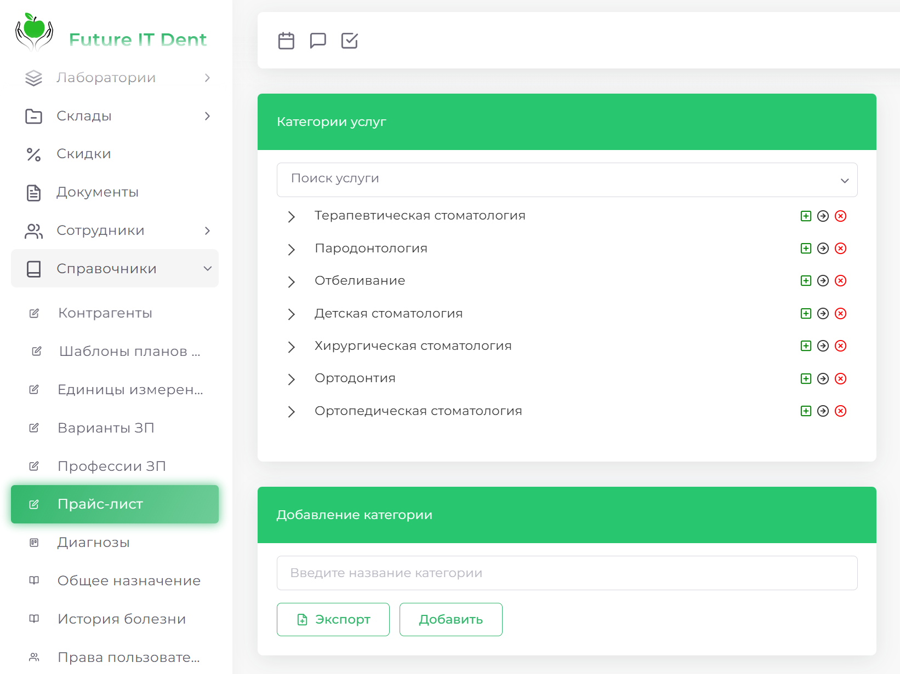

# Прайс-лист

Раздел "Прайс-лист" позволяет управлять услугами и категориями услуг клиники. Которые в дальнейшем будут доступны для выбора при составлении Плана лечения.
 
## Как добавить категорию услуг

1. Перейдите в раздел Справочники => Прайс-лист.

2. В блоке Добавление категории введите название категории и нажмите Добавить.

## Как удалить категорию услуг

1. Откройте раздел Справочники => Прайс-лист.
2. Выберите категорию, которую хотите удалить, и нажмите на красный крестик справа от названия.

3. Нажмите ОК

## Как изменить название категории услуг

1. Перейдите в раздел Справочники => Прайс-лист

2. Выберите нужную категорию, измените название 
3. Нажмите Сохранить

## Как добавить услугу

1. Откройте раздел Справочники => Прайс-лист, выберите нужную категорию услуг
2. Справа от названия нажмите на зелёный плюс

3. Нажмите Добавить запись и заполните необходимые поля

4. Нажмите Сохранить
