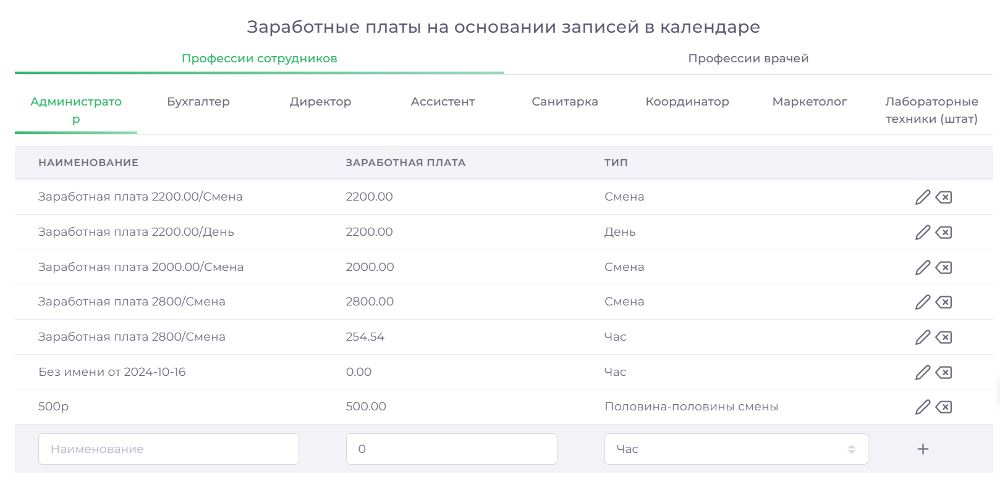

# Професси ЗП

В разделе "Настройка зарплат" можно добавлять, редактировать и удалять варианты заработной платы для каждой профессии. Модуль позволяет гибко настроить условия оплаты для сотрудников и врачей, исходя из типа их работы.

## Как создать вариант заработной платы

1. Зайдите в Справочники => Настройка зарплат.
2. Выберете нужную профессию из списка вкладок.
3. В нижней части таблицы введите название нового варианта заработной платы.
4. Укажите размер оплаты и выбрать тип (Смена, День, Час) 
 
5. Нажмите Сохранить.

## Как изменить вариант заработной платы

1. Зайдите в Справочники => Настройка зарплат.
2. Выберете нужную профессию из списка вкладок.
3. Нажмите на кнопку «карандаш» рядом с вариантом заработной платы.
4. Внесите необходимые изменения в данные.
5. Нажмите кнопку Сохранить.

 
## Как удалить вариант заработной платы

1. Перейдите в Справочники => Настройка зарплат.
2. Выберете нужную профессию из списка вкладок.
3. Найдите нужный вариант заработной платы и нажмите на значок справа от названия.
4. Подтвердить удаление.
**ПРИМЕЧАНИЕ**:
Модуль позволяет создавать варианты заработной платы не только для сотрудников, но и для врачей, что делает систему оплаты более гибкой и удобной для каждой категории персонала.

