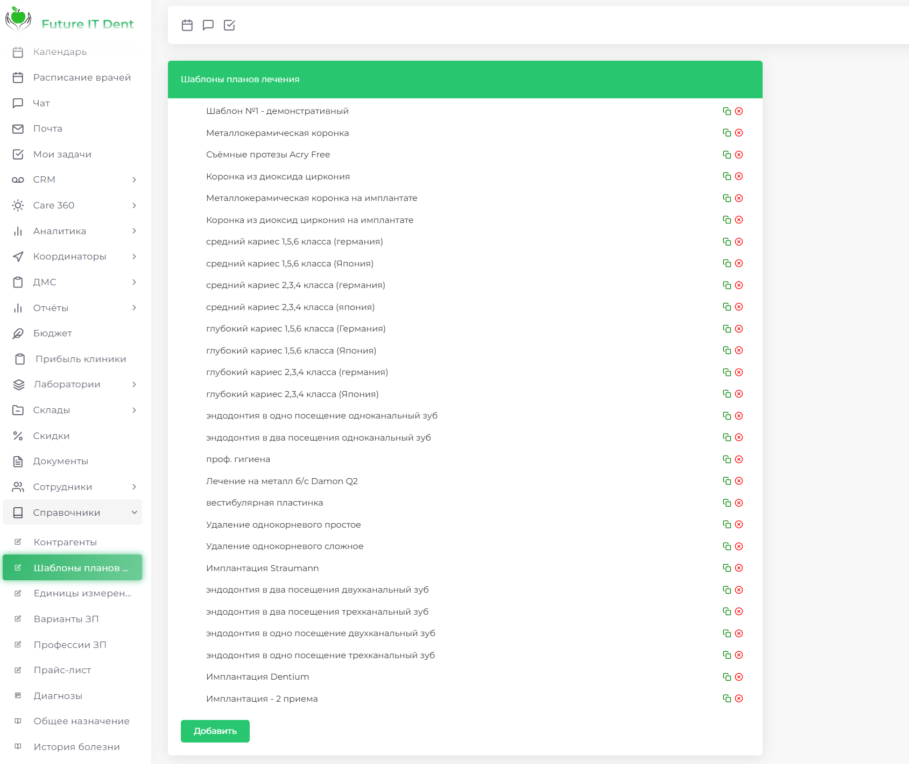
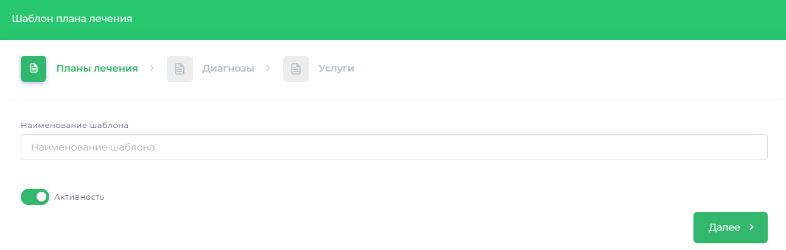
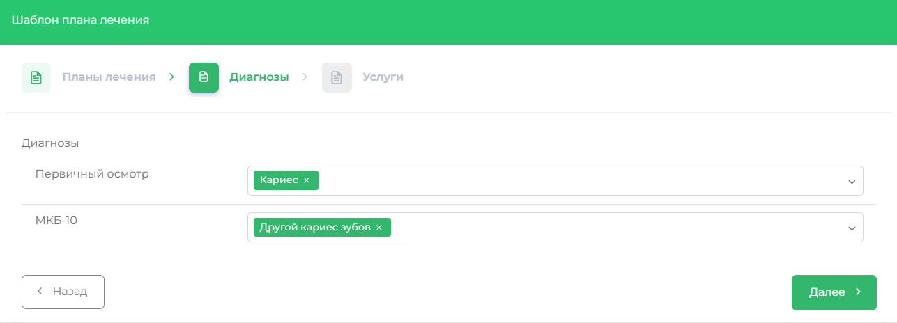
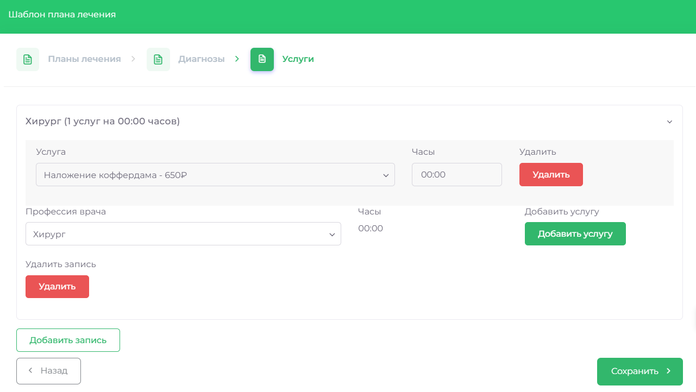
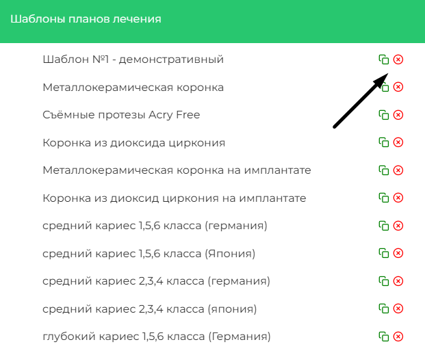
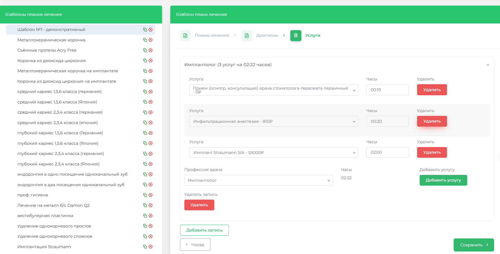

# Шаблоны планов лечения

В данном разделе пользователи могут добавлять, удалять и корректировать шаблоны планов лечения. Это позволяет стандартизировать процессы и ускорить подготовку документов для пациентов.

## Создать шаблон плана лечения

1. Перейдите в раздел **СПРАВОЧНИКИ** => **ШАБЛОНЫ ПЛАНОВ ЛЕЧЕНИЯ**
2. Нажмите кнопку **Добавить**
3. В правой части экрана введите название шаблона и убедитесь, что переключатель **АКТИВНОСТЬ** включён

4. Нажмите кнопку **ДАЛЕЕ**
5. В открывшемся меню выберите необходимые диагнозы и снова нажмите **ДАЛЕЕ**

6. На следующем экране можно составить план лечения:

    1. Выберите профессию врача (например, хирург)
    2. Колонка **ЧАСЫ** будет автоматически подсчитывать общее время лечения у данного врача

7. Нажмите **ДОБАВИТЬ УСЛУГУ**, выберите услугу и укажите количество часов на её выполнение.
    1. Используйте кнопку **УДАЛИТЬ** справа для удаления отдельной услуги
    2. Для удаления всего плана у врача нажмите **УДАЛИТЬ** в левом нижнем углу блока
8. Чтобы добавить план для другого врача, нажмите **ДОБАВИТЬ ЗАПИСЬ**
9. Когда все данные будут введены, нажмите **СОХРАНИТЬ**
 
## Удалить шаблон плана лечения

1. Перейдите в раздел **СПРАВОЧНИКИ** => **ШАБЛОНЫ ПЛАНОВ ЛЕЧЕНИЯ**

2. Найдите нужный шаблон и нажмите на значок КРАСНОГО КРЕСТИКА справа от названия
3. Подтвердите удаление, нажав **ОК**

 
## Изменить шаблон плана лечения

1. Перейдите в раздел **СПРАВОЧНИКИ** => **ШАБЛОНЫ ПЛАНОВ ЛЕЧЕНИЯ**
2. Найдите нужный шаблон и нажмите на его название

3. Используйте кнопки **ДАЛЕЕ** и **НАЗАД** для перехода между разделами и внесения изменений
4. Когда все изменения внесены, перейдите в раздел УСЛУГИ и нажмите **СОХРАНИТЬ**

