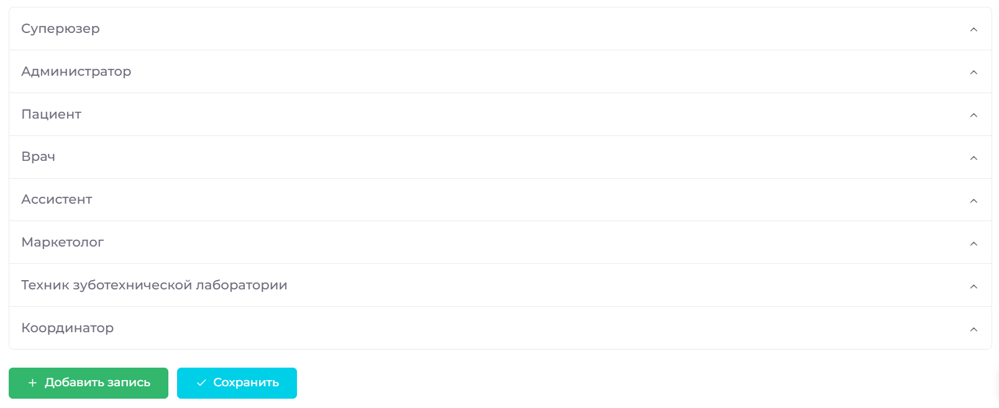
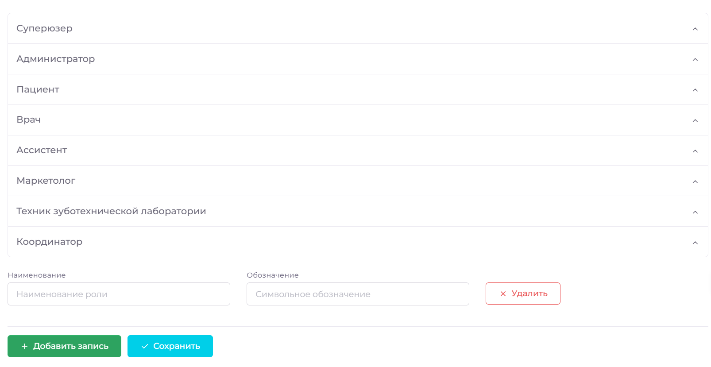
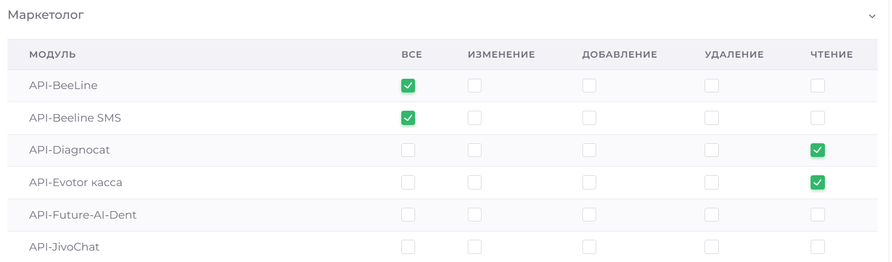
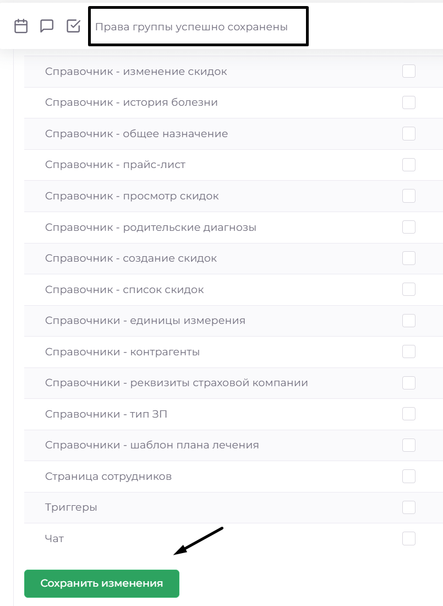

# Права пользователя

В разделе Права пользователей можно управлять правами доступа по группам пользователей. Это позволяет настроить доступ к различным модулям системы для различных категорий сотрудников. Также возможно индивидуальное назначение прав для отдельных сотрудников через модуль Сотрудники.

По умолчанию доступны шаблоны прав для суперюзера (полный доступ), врача, администратора, ассистента, маркетолога, техника зуботехнической лаборатории, координатора и пациента. Вы можете изменять их по своему усмотрению, расширяя возможности для определённой группы или наоборот, сокращая их. 

## Добавить группу пользователей

1. Перейдите в раздел Справочники => Права пользователей
2. Нажмите Добавить запись и пропишите название группы

3. Нажмите  Сохранить

 

## Изменить права для группы пользователей

1. Перейдите в раздел Справочники => Права пользователей
2. Выберете нужную группу, вам станет доступна таблица определения прав. Всего шесть столбцов: первый, с названием модуля и определённым его разделом (например, CRM – заявки); второй позволяет дать полный доступ к указанному разделу; последующие, позволяют предоставить отдельные возможности для группы пользователя в указанном разделе, такие как права на удаление, изменение, добавление и чтение. 

3. После определения всех необходимых прав, нажмите Сохранить изменения внизу таблицы. Дождитесь появления сообщения в верхней части страницы:

