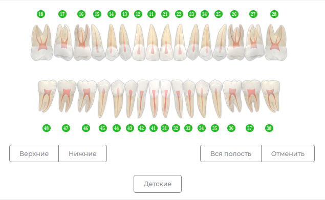
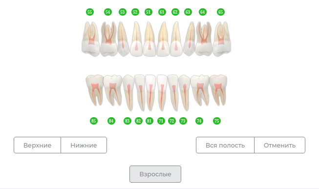
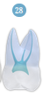
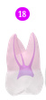
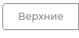
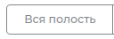
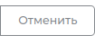
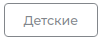
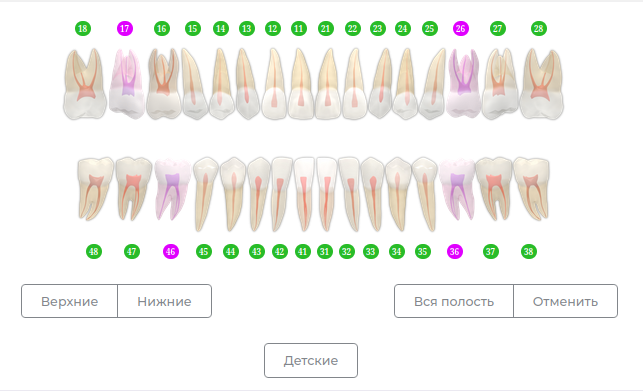
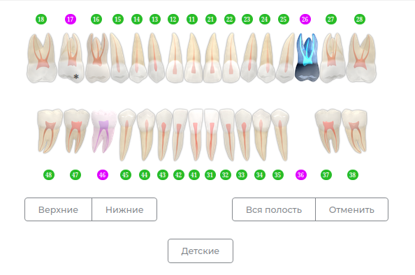

# Зубная формула

---

В приложении представлена интерактивная Зубная Формула, взаимодействуя с которой Вы можете заполнить [Диагнозы](docs/cardPatient/diagnoses.md), [Историю болезни](docs/cardPatient/history_disease.md), составить [План лечения](docs/cardPatient/t-plan.md).
Вы можете работать как со взрослой зубной формулой, так и с детской.

|Взрослая формула| Детская формула                             |
|---|---------------------------------------------|
||  |

Чтобы выделить нужный зуб, необходимо нажать по нему Левой Кнопкой Мыши. Так же выделить зуб можно нажав по номеру, расположенному над или под зубом.  
Чтобы отменить выбор зуба, нажмите на него еще раз. Так же можно нажать на кнопку "Отменить"

| Внешний вид                  | Состояние                                             |
|------------------------------|-------------------------------------------------------|
| Выбранный зуб                |    |
| Зуб, которому выбран диагноз |  |

Под зубной формулой расположены кнопки:

| Кнопка | Действие                                                            |
|--------|---------------------------------------------------------------------|
|        | Нажатие на кнопку выберет все верхние зубы                          |
|        | Нажатие на кнопку выберет все нижние зубы                           |
|        | Нажатие на кнопку выберет все зубы                                  |
|        | Нажатие на кнопку отменит выбор зуба                                |
|        | Нажатие на кнопку переключает зубную формулу между взрослой/детской |

В [диагностике](docs/cardPatient/diagnoses.md) зубы, для которых проставлены диагнозы буду выглядеть так:

На зубной формуле в модулях [История болезни](docs/cardPatient/history_disease.md) и [Плен лечения](docs/cardPatient/t-plan.md) автоматически будут отражены проставленные диагнозы:

